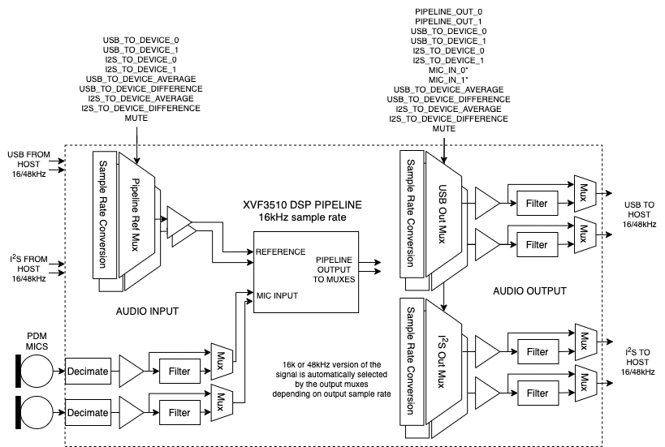
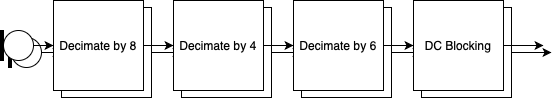
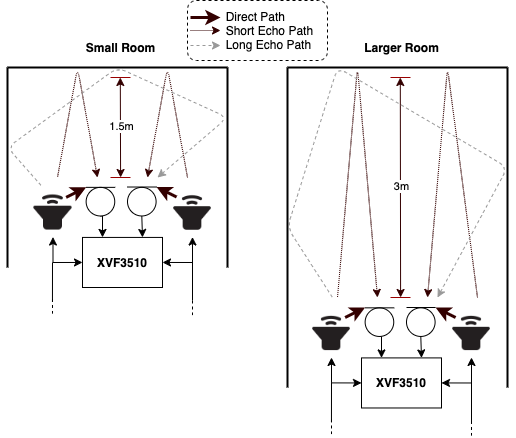
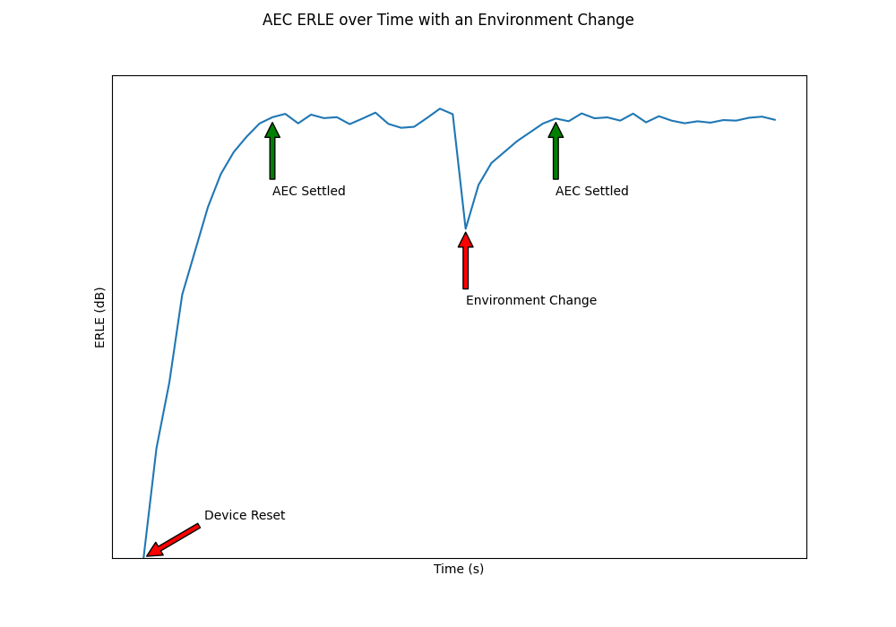
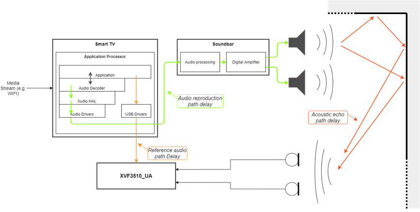
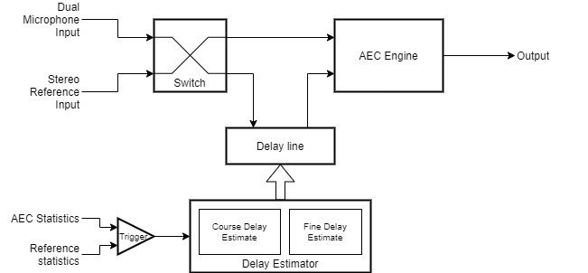
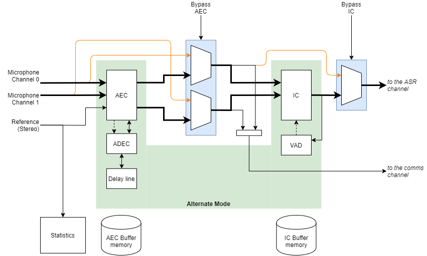
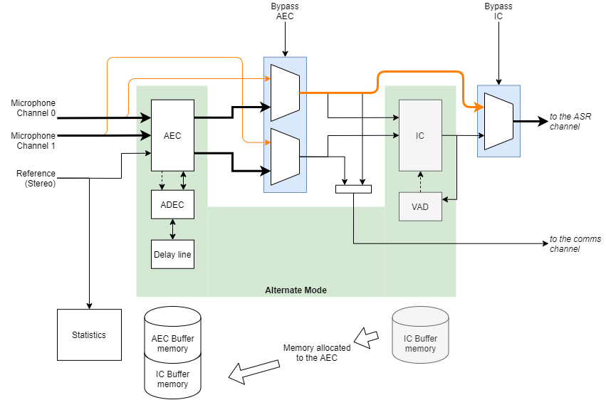
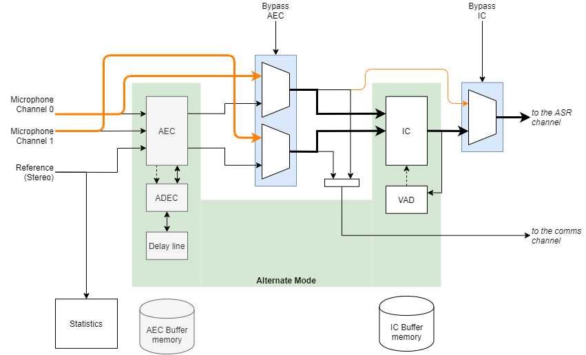

Interfaces, Audio Routing and Filtering
---------------------------------------

The Following section describes, the interfaces, audio routing and
filtering features of the XVF3610.  Each section can be referred to in
isolation, and describes all aspects relating to that feature.

Signal flow and processing
~~~~~~~~~~~~~~~~~~~~~~~~~~

Many of the parameters and functions of the XVF3610 may be controlled
via the control interface. This control extends to being able to
configure signal routing through the pipeline itself, providing
flexibility useful in:

-  Hardware testing of mics by monitoring the raw mic signal.

-  Improving pipeline performance by filtering known noise sources at
     the raw mic input.

-  Monitoring and debugging of reference signals and mic signals during
     development.

-  Compensating for gain offset in reference signal.

-  Supporting specific audio connectivity requirements such as obtaining
     the reference signal from I\ :sup:`2`\ S.

-  Inserting audio filtering where a speaker is connected downstream of
     the XVF3610 via I\ :sup:`2`\ S.

The blocks supported are as follows:

-  Signal Multiplexers. These allow dynamic selection (switching) of
     signals. The signals available depend on the multiplexer position.

-  Gain Blocks. These are blocks that apply a variable bit shift (left
     or right) and, in the case of left shift, saturate in the case of
     overflow. Because they are shifters, the gain applied is a power
     of two.

-  Filter Blocks. The filter blocks consist of two cascaded biquad
     units. Each of the five coefficients per stage is directly
     manipulated via the control utility.

The arrangement of the blocks, with respect to the device Input & Output
and the XVF3610 audio processing pipeline, is shown in Figure 4‑9 below:

  XVF3610 input, output and audio signal routing

The commands to control the audio multiplexes (Mux) blocks and detailed
in Table 4‑8 below and the source and destination index numbers are
listed in Table 4‑10 and Table 4‑9 respectively

Signal Routing and Scaling
''''''''''''''''''''''''''

The following controls are provided for configuring the signal control
blocks.

Table 4‑8 I/O Mapping Commands

+-----------------+----+----+------------------------------------------+
| Command         | Ty | Ar | Definition                               |
|                 | pe | gs |                                          |
+=================+====+====+==========================================+
| SET_IO_MAP      | u  | 2  | Configures the two input switches and    |
|                 | in |    | four output switches. See Destination    |
|                 | t8 |    | and Source index table for valid         |
|                 |    |    | argument options.                        |
|                 |    |    |                                          |
|                 |    |    | | arg1 <Destination Index>               |
|                 |    |    | | arg2 <Source Index>                    |
+-----------------+----+----+------------------------------------------+
| S               | i  | 2  | Sets the gain for each mux block. Select |
| ET_OUTPUT_SHIFT | nt |    | mux block Destination Index followed by  |
|                 | 32 |    | shift (+ve is left, -ve is right shift)  |
|                 |    |    |                                          |
|                 |    |    | | arg1 <Destination Index>               |
|                 |    |    | | arg2 <shift value>                     |
+-----------------+----+----+------------------------------------------+
| GET_I           | ui | 6  | Get all 18 IO_MAP and OUTPUT_SHIFT       |
| O_MAP_AND_SHIFT | nt | x  | values for all Destinations.             |
|                 | 32 | 3  |                                          |
+-----------------+----+----+------------------------------------------+
| SET_MIC         | ui | 2  | Sets the gain on the raw mic signals     |
| _SHIFT_SATURATE | nt |    | before entering the pipeline.            |
|                 | 32 |    |                                          |
| GET_MIC         |    |    | | arg1 <shift value (left shift)>        |
| _SHIFT_SATURATE |    |    | | arg2 <saturate, enable if =1>          |
+-----------------+----+----+------------------------------------------+

Where the Destination channels available to be mapped are referenced as
follows:

Table 4‑9 I/O Mapping Destination Indexes

+----------------------+------+----------------------------------------+
| Channel              | V    | Definition                             |
| (Destination)        | alue |                                        |
+======================+======+========================================+
| USB_FROM_DEVICE_0    | 0    | USB channel 0 output from device to    |
|                      |      | host                                   |
+----------------------+------+----------------------------------------+
| USB_FROM_DEVICE_1    | 1    | USB channel 1 output from device to    |
|                      |      | host                                   |
+----------------------+------+----------------------------------------+
| I2S_FROM_DEVICE_0    | 2    | I2S channel 0 output from device       |
+----------------------+------+----------------------------------------+
| I2S_FROM_DEVICE_1    | 3    | I2S channel 1 output from device       |
+----------------------+------+----------------------------------------+
| REF_TO_PIPELINE_0    | 4    | reference channel 0 going into the     |
|                      |      | pipeline                               |
+----------------------+------+----------------------------------------+
| REF_TO_PIPELINE_1    | 5    | reference channel 1 going into the     |
|                      |      | pipeline                               |
+----------------------+------+----------------------------------------+

Sources available to be mapped to destination are referenced as follows:

Table 4‑10 I/O Mapping Source Indexes

+------------------+-----+--------------------------------------------+
| Channel (Source) | Va  | Definition                                 |
|                  | lue |                                            |
+==================+=====+============================================+
| MUTE             | 0   | Zeros are sent to the destination if this  |
|                  |     | value is selected, which mutes the channel |
+------------------+-----+--------------------------------------------+
| USB_T            | 1   | Average of USB input from host to device.  |
| O_DEVICE_AVERAGE |     |                                            |
+------------------+-----+--------------------------------------------+
| USB_TO_D         | 2   | Half of the difference between ch0 and ch1 |
| EVICE_DIFFERENCE |     | of USB input from host to device.          |
+------------------+-----+--------------------------------------------+
| I2S_T            | 3   | Average of I2S input to device.            |
| O_DEVICE_AVERAGE |     |                                            |
+------------------+-----+--------------------------------------------+
| I2S_TO_D         | 4   | Half of the difference between ch0 and ch1 |
| EVICE_DIFFERENCE |     | of I2S input to device.                    |
+------------------+-----+--------------------------------------------+
| PIPELINE_OUT_0   | 5   | Pipeline output channel 0                  |
+------------------+-----+--------------------------------------------+
| PIPELINE_OUT_1   | 6   | Pipeline output channel 1                  |
+------------------+-----+--------------------------------------------+
| USB_TO_DEVICE_0  | 7   | USB input channel 0 from host to device    |
+------------------+-----+--------------------------------------------+
| USB_TO_DEVICE_1  | 8   | USB input channel 1 from host to device    |
+------------------+-----+--------------------------------------------+
| I2S_TO_DEVICE_0  | 9   | I2S input channel 0 to device              |
+------------------+-----+--------------------------------------------+
| I2S_TO_DEVICE_1  | 10  | I2S input channel 1 to device              |
+------------------+-----+--------------------------------------------+
| MIC_IN_0         | 11  | Ch0 Microphone input seen by the pipeline  |
+------------------+-----+--------------------------------------------+
| MIC_IN_1         | 12  | Ch1 Microphone input seen by the pipeline  |
+------------------+-----+--------------------------------------------+
| PACKED           | 13  | pack 16kHz pipeline output on 48kHz output |
| _PIPELINE_OUTPUT |     | (See Appendix J: Capturing packed samples  |
|                  |     | for system integration for further         |
|                  |     | information)                               |
+------------------+-----+--------------------------------------------+
| PACKED_MIC       | 14  | pack 16kHz mic input to pipeline on 48kHz  |
|                  |     | output (See Appendix J):                   |
+------------------+-----+--------------------------------------------+
| PACKED_REF       | 15  | pack 16kHz reference input to pipeline on  |
|                  |     | 48kHz output (See Appendix J)              |
+------------------+-----+--------------------------------------------+
| PACKED_ALL       | 16  | pack 1 channel of 16kHz mic, reference     |
|                  |     | input and pipeline. When this option is    |
|                  |     | used, the other channel of the same output |
|                  |     | also gets PACKED_ALL set in its IO map.    |
|                  |     | (See Appendix J: Capturing packed samples  |
|                  |     | for system integration for further         |
|                  |     | information)                               |
+------------------+-----+--------------------------------------------+

NOTE: The MIC_IN_0 and MIC_IN_1 signals are at 16kHz. If they are routed
to a 48kHz output they will be sample repeated three times. No
antialiasing filter is applied.

The following section illustrates how to use the IO mapping and scaling
commands.

Using the SET_IO_MAP command, the user can choose the sources that get
routed to the following 3 destinations -

-  the USB output from device to host

-  the I2S output from the device

-  the reference going into the device

For instance, to route I2S channel 0 (= 9 as shown in the Source table)
input to the device to USB channel 1 output from the device ( = 1 as
shown in the destination table), the command is:

vfctrl_usb SET_IO_MAP 1 9

where the first argument “1” refers to USB_FROM_DEVICE_1 as shown in the
destination table and the second argument “9” refers to I2S_TO_DEVICE_0
in the source table.

Signal routing is also useful for hardware debugging of microphone or
reference signal connection. As an example, the following command routes
USB reference channel 0 from host to the USB audio output channel 0 of
XVF3610:

vfctrl_usb SET_IO_MAP 0 7

A loopback of reference signal input XVF3610 and its audio output is
formed. By playing back signal, e.g. a sine wave as the reference signal
output from host, the user can verify if the signal is being received
properly by XVF3610 through its audio output. If the audio signal
recorded at host is different from the reference output, the user may
check if the problem is caused by hardware connection failure or wrong
data format.

Signal routing can also be used for debugging microphone signal:

vfctrl_usb SET_IO_MAP 1 12

The above command routes microphone channel 1 as the direct signal to
XVF3610’s USB audio output. Microphone signals can the be verified by
recording XVF3610’s audio output.

For XVF3610-UA, its I\ :sup:`2`\ S master interface can be used for
sending out different kind of signal shown in the source channel table
while having USB outputs of processed audio. For example, the following
command configures to send channels of mic, reference and pipeline
outputs in 16kHz sampling frequency packed to 48kHz I\ :sup:`2`\ S
output:

vfctrl_usb SET_IO_MAP 2 16

vfctrl_usb SET_IO_MAP 3 16

By using Raspberry Pi with I\ :sup:`2`\ S slave interface configured,
the user can then capture synchronized signals of mic, reference and
pipeline output. Observing these signals can be very useful for
debugging. The packed signal can be unpacked to mic, reference and
pipeline signal with 2 channels in each of them by using a Python script
provided in the Release Package.

The SET_OUTPUT_SHIFT command can be used to specify a bit shift that is
applied to all samples of a given target. For example, specifying:

vfctrl_usb SET_OUTPUT_SHIFT 2 4

applies a left shift of 4 bits on all samples output from the device on
I2S channel 0 as 2\ :sup:`4`\ =16x of gain. A negative shift value would
imply a right bit shift for attenuation.

The GET_IO_MAP_AND_SHIFT command displays the IO mapping and the shift
values for all targets.

Executing a GET_IO_MAP_AND_SHIFT command without having set any mapping
or shifts explicitly shows the default mapping that is configured in
firmware.

vfctrl_usb GET_IO_MAP_AND_SHIFT

GET_IO_MAP_AND_SHIFT:

target: USB_FROM_DEVICE_0, source: PIPELINE_OUT_0 output shift: NONE

target: USB_FROM_DEVICE_1, source: PIPELINE_OUT_1 output shift: NONE

target: I2S_FROM_DEVICE_0, source: PIPELINE_OUT_0 output shift: NONE

target: I2S_FROM_DEVICE_1, source: FAR_END_IN_0 output shift: NONE

target: REF_TO_PIPELINE_0, source: USB_TO_DEVICE_0 output shift: NONE

target: REF_TO_PIPELINE_1, source: USB_TO_DEVICE_1 output shift: NONE

General Purpose Filter
''''''''''''''''''''''

The General Purpose filter blocks each comprise of two cascade biquad
filters permitting configuration as bandpass, notch, low-pass, high-pass
filters etc. By default, all filters are disabled (bypassed).

NOTE: A maximum of two output filters may be enabled simultaneously. Eg.
Two channels of USB filtering or one I2S and one USB output. Exceeding
this may cause audio glitching.

There is no restriction on input filters (mic and reference filters).

The filter coefficients are accepted in a floating-point format in a1,
a2, b0, b1, b2 order directly from filter design tools such as
https://arachnoid.com/BiQuadDesigner/index.html.

Support for the raw 32bit integer write/read is offered which directly
accesses the internal representation. When using the raw control method,
coefficients should be converted to Q28.4 format first and a\ :sub:`1`
and a\ :sub:`2` need to be negated. See configuration parameters for
more information.

The sample rate for filters on the input to the pipeline are always
16kHz whereas the output filters match the selected rate which may be
either 16kHz or 48kHz, depending on system configuration. Ensure that
the filter coefficients have been designed with the correct rate.

Note that, although potential numerical overflows are handled as a
saturation, it is up to the designer to ensure no saturation occurs from
the coefficients chosen to avoid non-linear behaviour of the filter. The
implementation offers three bits of headroom (Q28.4) which is more than
sufficient for most filters.

The coefficients are cleared to zero on boot.

The following table describes the commands for the configuration of the
filters.

Table 4‑11 Filter configuration parameters

+---------------+----+----------+--------------------------------------+
| Command       | Ty | A        | Definition                           |
|               | pe | rguments |                                      |
+===============+====+==========+======================================+
| SET           | u  | 1        | Used as an index to point to which   |
| _FILTER_INDEX | in |          | filter block that will be            |
|               | t8 |          | manipulated. output_filter_map_t     |
|               |    |          | below defines the filter block IDs.  |
+---------------+----+----------+--------------------------------------+
| GET           | u  | 1        | Retrieve the current filter index.   |
| _FILTER_INDEX | in |          |                                      |
|               | t8 |          |                                      |
+---------------+----+----------+--------------------------------------+
| SET_FITER     | u  | 1        | Bypass (1) means filter pointed to   |
| _BYPASS       | in |          | by the index is not enabled          |
|               | t8 |          | (default), 0 means enable the        |
|               |    |          | filter.                              |
+---------------+----+----------+--------------------------------------+
| GET_FILTER    | u  | 1        | Retrieve the bypass status.          |
| _BYPASS       | in |          |                                      |
|               | t8 |          |                                      |
+---------------+----+----------+--------------------------------------+
| SET           | f  | 10 (5x2) | Set 5 x 2 biquad coefficients in a   |
| _FILTER_COEFF | lo |          | floating-point format in the order   |
|               | at |          | a1, a2, b0, b1, b2. Coefficient a0   |
|               |    |          | is assumed to be 1.0. If it is not,  |
|               |    |          | divide all coefficients by a0.       |
+---------------+----+----------+--------------------------------------+
| GET           | f  | 10 (5x2) | Retrieve the floating-point          |
| _FILTER_COEFF | lo |          | representation of the coefficients   |
|               | at |          | in the order a1, a2, b0, b1, b2.     |
+---------------+----+----------+--------------------------------------+
| SET_FIL       | i  | 10 (5x2) | Set 5 x 2 biquad coefficients in     |
| TER_COEFF_RAW | nt |          | Q28.4 format for the filter pointed  |
|               | 32 |          | to by the index. See note above in   |
|               |    |          | Filter Blocks section about the      |
|               |    |          | format.                              |
+---------------+----+----------+--------------------------------------+
| GET_FIL       | i  | 10 (5x2) | Retrieve the Q28.4 representation of |
| TER_COEFF_RAW | nt |          | the coefficients. See note above in  |
|               | 32 |          | Filter Blocks section about the      |
|               |    |          | format.                              |
+---------------+----+----------+--------------------------------------+

Filter output indexes available to be used with filter setting commands
(output_filter_map_t):

+----------------------+-----+----------------------------------------+
| Channel              | Va  | Definition                             |
|                      | lue |                                        |
+======================+=====+========================================+
| FILT                 | 0   | USB channel 0 from device to host      |
| ER_USB_FROM_DEVICE_0 |     | (Left)                                 |
+----------------------+-----+----------------------------------------+
| FILT                 | 1   | USB channel 1 from device to host      |
| ER_USB_FROM_DEVICE_1 |     | (Right)                                |
+----------------------+-----+----------------------------------------+
| FILT                 | 2   | I2S channel 0 from device (Left)       |
| ER_I2S_FROM_DEVICE_0 |     |                                        |
+----------------------+-----+----------------------------------------+
| FILT                 | 3   | I2S channel 1 output from device       |
| ER_I2S_FROM_DEVICE_1 |     | (Right)                                |
+----------------------+-----+----------------------------------------+
| FILT                 | 4   | 16kHz mic channel 0 going into the     |
| ER_MIC_TO_PIPELINE_0 |     | pipeline                               |
+----------------------+-----+----------------------------------------+
| FILT                 | 5   | 16kHz mic channel 1 going into the     |
| ER_MIC_TO_PIPELINE_1 |     | pipeline                               |
+----------------------+-----+----------------------------------------+
| FILT                 | 6   | 16kHz reference channel 0 going into   |
| ER_REF_TO_PIPELINE_1 |     | the pipeline (Left)                    |
+----------------------+-----+----------------------------------------+
| FILT                 | 7   | 16kHz reference channel 1 going into   |
| ER_REF_TO_PIPELINE_1 |     | the pipeline (Right)                   |
+----------------------+-----+----------------------------------------+

While setting the index or bypass control will always be safe, there is
a small chance that the coefficients may be partially updated halfway
through a filter operation. For this reason, the filter state is also
cleared following updating to ensure that any possibility of instability
is reduced. It is up to the user to ensure that the coefficients
provided result in a stable filter configuration.

See Appendix G for a worked example on filter definition.

Far-Field Voice Processing
--------------------------

PDM microphone interface
~~~~~~~~~~~~~~~~~~~~~~~~

The PDM microphone interface converts Pulse Density Modulation (PDM)
audio input from the microphones to Pulse Code Modulation (PCM) format
allowing further processing. The PDM microphone interface consists of
the physical pins connecting to the two microphones and a series of
filters resulting in a 16kHz PCM, two-channel output stream suitable for
far-field voice processing. Please refer to the datasheet for the
physical and electrical details of the PDM pins.

The processing consists of four filter stages:

-  Decimate by 8 FIR filter to 384kHz

-  Decimate by 4 FIR filter to 96kHz

-  Decimate by 6 FIR filter to 16kHz

-  DC Blocking, single-pole IIR filter

  PDM microphone processing steps

The PDM microphone interface uses 32-bit internal processing to provide
very low distortion with a specification exceeding -110dB THD+N with a
140dB dynamic range.

The frequency response of the FIR filter has a stopband attenuation of
at least 70dB with a passband ripple of less than 0.9dB and a passband
of 6.8kHz. The total group delay from pin to the XVF3610 audio pipeline
input is 1.125 milliseconds.

A DC blocking filter is placed at the end of the PDM microphone
interface pipeline and is tuned to have a 5Hz -6dB point and removes any
DC offset present in the PDM input.

The output from the PDM microphone interface may optionally be shifted
or attenuated providing a ‘power of two’ gain control. Saturation may be
applied in the case that the gain is greater than one.

By default, the gain block shift is set to zero (a gain of 2\ :sup:`0` =
1) and this is the recommended setting for normal use.

The PDM interface control parameters are shown below:

Table 4‑12 Microphone commands

+---------------------+----+-----------+------------------------+----+
| Command             | Ty | Value     | Description            | N  |
|                     | pe |           |                        | ot |
|                     |    |           |                        | es |
+=====================+====+===========+========================+====+
| SET                 | ui | arg1      | Write the gain (power  |    |
| _MIC_SHIFT_SATURATE | nt | <shift    | of 2) on the raw mic   |    |
|                     | 32 | value     | signals before         |    |
|                     |    | (left     | entering the audio     |    |
|                     |    | shift)>   | pipeline.              |    |
|                     |    | arg2      |                        |    |
|                     |    | <         |                        |    |
|                     |    | saturate, |                        |    |
|                     |    | enable if |                        |    |
|                     |    | !=0>      |                        |    |
+---------------------+----+-----------+------------------------+----+
| GET                 | ui |           | Read the gain (power   |    |
| _MIC_SHIFT_SATURATE | nt |           | of 2) on the raw mic   |    |
|                     | 32 |           | and Saturate Enable    |    |
|                     |    |           | signals before         |    |
|                     |    |           | entering the audio     |    |
|                     |    |           | pipeline.              |    |
+---------------------+----+-----------+------------------------+----+

Automatic Echo Cancellation (AEC)
~~~~~~~~~~~~~~~~~~~~~~~~~~~~~~~~~

This process uses the stereo audio from the product as a reference
signal to model the echo characteristics between each loudspeaker and
microphone, caused by the acoustic environment of the device and room.

The AEC uses four models to continuously remove echoes in the microphone
audio input created in the room by the loudspeakers. The models
continually adapt to the acoustic environment to accommodate changes in
the room created by events such as doors opening or closing and people
moving about.

An illustration of echo paths in two sizes of room are shown below.

  Echo paths from the speakers to the microphones

After reset, or when echo paths change due to a change in the
environment, the AEC will re-converge. Echo Return Loss Enhancement
(ERLE) can be used to indicate the degree of convergence on the AEC
filters as shown below.

  Settling time of the AEC shown using an ERLE plot

For optimal AEC settling-time performance, the volume of the speakers
must be linearly proportional to the level of the reference audio sent
to the XVF3610. If the volume of the speakers change without the level
of the reference changing by the same linear factor, the AEC will
respond as if the environment has changed such that all echo paths have
increased/decreased energy, and will therefore incur a settling time in
the AEC.

The Alternative Architecture (described in the *Alternative Architecture
mode (ALT_ARCH)* section\ *)* selectively extends the AEC filters to
accommodate highly reverberant environments.

The configuration parameters for the AEC are shown below:

Table 4‑13 Useful Automatic Echo Canceller (AEC) commands

+---------------------+----+-----------+----------------------+------+
| Command             | Ty | Value     | Description          | N    |
|                     | pe |           |                      | otes |
+=====================+====+===========+======================+======+
| GET_BYPASS_AEC      | ui | [0,1]     | Get/Set AEC bypass   | A    |
|                     | nt |           | parameter. If set to |      |
| SET_BYPASS_AEC      | 32 | 0 = AEC   | one, AEC processing  |      |
|                     |    | bypass    | is disabled.         |      |
|                     |    | disabled  |                      |      |
|                     |    | (default) |                      |      |
|                     |    |           |                      |      |
|                     |    | 1 = AEC   |                      |      |
|                     |    | bypass    |                      |      |
|                     |    | enabled   |                      |      |
+---------------------+----+-----------+----------------------+------+
| SET_AD              | ui | [0, 1, 2] | Sets AEC adaptation  | B    |
| APTATION_CONFIG_AEC | nt |           | configuration. If    |      |
|                     | 32 | 0 = Auto  | AEC is set to bypass |      |
| GET_AD              |    | adapt     | then setting the     |      |
| APTATION_CONFIG_AEC |    | (default) | adaptation config    |      |
|                     |    |           | has no effect.       |      |
|                     |    | 1 = Force |                      |      |
|                     |    | a         |                      |      |
|                     |    | daptation |                      |      |
|                     |    | ON        |                      |      |
|                     |    |           |                      |      |
|                     |    | 2 = Force |                      |      |
|                     |    | a         |                      |      |
|                     |    | daptation |                      |      |
|                     |    | OFF       |                      |      |
+---------------------+----+-----------+----------------------+------+
| GET_ERLE_CH0_AEC    | f  |           | Get AEC ERLE for     |      |
|                     | lo |           | channel 0            |      |
|                     | at |           |                      |      |
+---------------------+----+-----------+----------------------+------+
| GET_ERLE_CH1_AEC    | f  |           | Get AEC ERLE for     | C    |
|                     | lo |           | channel 1            |      |
|                     | at |           |                      |      |
+---------------------+----+-----------+----------------------+------+
| RESET_FILTER_AEC    |    |           | This command resets  |      |
|                     |    |           | all AEC filters.     |      |
+---------------------+----+-----------+----------------------+------+

**[A]** When the Alternative Architecture (ALT_ARCH) mode is enabled
(default), AEC bypass state will be overwritten and so should not be
used. The GET command remains functional. For more information see the
*Alternative Architecture* *(ALT_ARCH)* section.

**[B]** If Automatic Delay Estimation is enabled, these parameters will
be overwritten and so should not be used. The GET commands remain
functional. For more information see the *Automatic Delay Estimation &
Correction (ADEC)* section.

**[C]** When the ALT_ARCH mode is enabled, there is only valid ERLE data
available on CH0. In this mode the GET_ERLE_CH1_AEC will report NaN.

NOTE: The AEC operates on acoustic paths modelled in the AEC tail
length. The Automatic Delay Estimation and Correction module handles
delays between microphone and loudspeaker introduced by the equipment,
for instance receiving the reference ahead of it actually being played
out of the loudspeakers.

Automatic Delay Estimation & Correction (ADEC)
~~~~~~~~~~~~~~~~~~~~~~~~~~~~~~~~~~~~~~~~~~~~~~

The ADEC module automatically corrects for possible delay offsets
between the reference and the loudspeakers.

Echo cancellation is an adaptive filtering process which compares the
reference audio to that received from the microphones. It models the
reverberant time of a room, i.e. the time it takes for acoustic
reflections to decay to insignificance. This is shown in the figure
below (the red “Acoustic echo path delay”).

The time window modelled by the AEC is finite, and to maximise its
performance it is important to ensure that the reference audio is
presented to the AEC time aligned to the audio being reproduced by the
loudspeakers. The diagram below highlights how the reference audio path
delay and the audio reproduction path may be significantly different,
therefore requiring additional delay to be inserted into one of the two
paths, correcting this delay difference.

  ADEC use case diagram

The functional blocks in the ADEC are shown below:

  ADEC block diagram

Delay corrections may be applied to either microphone or reference path,
to cope with reference or loudspeaker being ahead of the other,
accomplished by switching the delay into either the microphone channel
or the reference channel.

Automatic delay estimation is triggered at power-up, or if the host
system configuration changes. The process will not begin until the
reference signal is present and has sufficient energy.

The delay estimation process supports two stages:

-  Fine delay estimation, during which AEC adaption is paused. Fine
     delay estimation searches over a limited delay window to detect
     small changes in delay. If the delay correction is not resolved
     the coarse estimation is triggered.

-  Coarse delay estimation, re-purposes the AEC to detect larger delays.
     During estimation, the AEC does not perform cancellation. Once the
     delay is detected, and delay correction made the AEC restarts and
     converges based on the delayed signals.

Possible causes that may trigger coarse estimation:

-  Device reset (if initial delay estimation is enabled, default:
     enabled)

-  Host changing applications

-  Large volume changes between the reference and the loudspeaker
     play-back

-  User equipment changes, such as switching from TV audio output to
     playing the audio through a soundbar

Possible causes that may trigger fine estimation:

-  Host toggling between audio devices (such as using a voice assistant
     application and listening to music at the same time) This is
     typically only seen in USB configurations

-  Host processor performance leading to poor USB buffer management

The characteristics and specification of the ADEC function is shown
below:

Table 4‑14 ADEC characteristics

+---------+------------------+----------------------------------------+
| Name    | Value            | Description                            |
+=========+==================+========================================+
| Maximum | ± 150ms          | The maximum delay that can be added to |
| delay   |                  | either the microphone channel or the   |
| cor     |                  | reference channel.                     |
| rection |                  |                                        |
+---------+------------------+----------------------------------------+
| Coarse  | With good        | During this time AEC is disabled. Note |
| est     | reference SNR:   | that estimation will not start unless  |
| imation | 2-5 seconds      | reference is available and             |
| time    |                  | loudspeakers are playing back.         |
+---------+------------------+----------------------------------------+
| Fine    | <1 second.       | During this time adaptation in the AEC |
| est     |                  | is disabled. Note that estimation will |
| imation | If fine-grain    | not start unless reference is          |
| time    | estimation       | available and loudspeakers are playing |
|         | fails,           | back.                                  |
|         | coarse-grain     |                                        |
|         | estimation is    |                                        |
|         | triggered.       |                                        |
+---------+------------------+----------------------------------------+

The configuration commands are shown below:

Table 4‑15 Automatic Delay Estimator parameters

+---------------------+----+-----------+------------------------+----+
| Command             | Ty | Value     | Description            | N  |
|                     | pe |           |                        | ot |
|                     |    |           |                        | es |
+=====================+====+===========+========================+====+
| GET_DELAY_SAMPLES   | ui | [0 ..     | Change the number of   | A  |
|                     | nt | 2399]     | samples of input delay |    |
| SET_DELAY_SAMPLES   | 32 |           | at the sample rate     |    |
|                     |    |           | 16kHz.                 |    |
|                     |    |           |                        |    |
|                     |    |           | | The delay is applied |    |
|                     |    |           |   to either the        |    |
|                     |    |           | | reference or the     |    |
|                     |    |           |   microphone in        |    |
|                     |    |           | | put according to the |    |
|                     |    |           |   delay direction.     |    |
|                     |    |           |                        |    |
|                     |    |           | This provides a        |    |
|                     |    |           | maximum delay of +/-   |    |
|                     |    |           | 150mS.                 |    |
+---------------------+----+-----------+------------------------+----+
| GET_DELAY_DIRECTION | ui | [0,1]     | Select the direction   | A  |
|                     | nt |           | of input delay.        |    |
| SET_DELAY_DIRECTION | 32 | 0 -       |                        |    |
|                     |    | Delay     | i.e. it is applied to  |    |
|                     |    | the       | either the microphone  |    |
|                     |    | reference | input path or the      |    |
|                     |    | input     | reference signal path. |    |
|                     |    | (default) |                        |    |
|                     |    |           |                        |    |
|                     |    | 1 -       |                        |    |
|                     |    | Delay     |                        |    |
|                     |    | the       |                        |    |
|                     |    | microphone|                        |    |
|                     |    | input     |                        |    |
+---------------------+----+-----------+------------------------+----+
| GET_DELAY_ESTIMATE  | ui | [0 ..     | Get an estimate of the |    |
|                     | nt | 7200]     | number of samples of   |    |
|                     | 32 |           | delay on the reference |    |
|                     |    |           | input at a sample rate |    |
|                     |    |           | of 16kHz. This value   |    |
|                     |    |           | is valid only when a   |    |
|                     |    |           | coarse-grain delay     |    |
|                     |    |           | estimation is in       |    |
|                     |    |           | progress, and is       |    |
|                     |    |           | offset by the maximum  |    |
|                     |    |           | length of the delay    |    |
|                     |    |           | buffer (2400 samples). |    |
|                     |    |           | Add 2400 samples to    |    |
|                     |    |           | this value to get the  |    |
|                     |    |           | absolute delay         |    |
|                     |    |           | estimate.              |    |
+---------------------+----+-----------+------------------------+----+
| SET_ADEC_ENABLED    | ui | [0, 1]    | Enable automatic       |    |
|                     | nt |           | coarse-grain delay     |    |
| GET_ADEC_ENABLED    | 32 | 0 - ADEC  | control.               |    |
|                     |    | disabled  |                        |    |
|                     |    |           | If automatic           |    |
|                     |    | 1 - ADEC  | fine-grain delay       |    |
|                     |    | enabled   | control is enabled     |    |
|                     |    |           | (SET_LOCKER_ENABLED    |    |
|                     |    |           | 1), this parameter is  |    |
|                     |    |           | overridden by a state  |    |
|                     |    |           | machine internal to    |    |
|                     |    |           | the firmware.          |    |
+---------------------+----+-----------+------------------------+----+
| GET_ADEC_MODE       | ui | [0,1]     | Get the status of      |    |
|                     | nt |           | coarse-grain delay     |    |
|                     | 32 | 0 -       | estimation.            |    |
|                     |    | Normal    |                        |    |
|                     |    | AEC mode  |                        |    |
|                     |    |           |                        |    |
|                     |    | 1 - delay |                        |    |
|                     |    | e         |                        |    |
|                     |    | stimation |                        |    |
|                     |    | in        |                        |    |
|                     |    | progress  |                        |    |
+---------------------+----+-----------+------------------------+----+
| SET_MANUAL          | ui |           | Trigger a delay        |    |
| _ADEC_CYCLE_TRIGGER | nt |           | estimation cycle.      |    |
|                     | 32 |           |                        |    |
|                     |    |           | The default behaviour  |    |
|                     |    |           | in firmware is to      |    |
|                     |    |           | trigger a coarse-grain |    |
|                     |    |           | delay estimation cycle |    |
|                     |    |           | when the far end       |    |
|                     |    |           | reference is detected  |    |
|                     |    |           | for the first time     |    |
|                     |    |           | after device reset.    |    |
|                     |    |           | This is done           |    |
|                     |    |           | irrespective of        |    |
|                     |    |           | whether automatic      |    |
|                     |    |           | coarse-grain delay     |    |
|                     |    |           | control is enabled or  |    |
|                     |    |           | disabled. To disable   |    |
|                     |    |           | this initial delay     |    |
|                     |    |           | estimation, set        |    |
|                     |    |           | SET_MANUA              |    |
|                     |    |           | L_ADEC_CYCLE_TRIGGER=0 |    |
|                     |    |           | in the data partition. |    |
|                     |    |           |                        |    |
|                     |    |           | For all other times,   |    |
|                     |    |           | if coarse-grain delay  |    |
|                     |    |           | estimation is          |    |
|                     |    |           | disabled, the          |    |
|                     |    |           | SET_MAN                |    |
|                     |    |           | UAL_ADEC_CYCLE_TRIGGER |    |
|                     |    |           | can be used to force a |    |
|                     |    |           | coarse-grain delay     |    |
|                     |    |           | estimation cycle.      |    |
+---------------------+----+-----------+------------------------+----+
| GET_AEC_PE          | f  |           | Get current AEC filter |    |
| AK_TO_AVERAGE_RATIO | lo |           | coefficients peak to   |    |
|                     | at |           | average ratio. If this |    |
|                     |    |           | value is above 4, the  |    |
|                     |    |           | AEC has a “good” peak  |    |
|                     |    |           | to average ratio.      |    |
+---------------------+----+-----------+------------------------+----+
| SET_LOCKER_ENABLED  | ui | [0,1]     | Enable automatic       |    |
|                     | nt |           | fine-grain delay       |    |
| GET_LOCKER_ENABLED  | 32 | 0 -       | control. If enabled,   |    |
|                     |    | Automatic | the fine-grain delay   |    |
|                     |    | f         | control state machine  |    |
|                     |    | ine-grain | overrides the setting  |    |
|                     |    | delay     | for automatic          |    |
|                     |    | control   | coarse-grain delay     |    |
|                     |    | disabled  | control, so the        |    |
|                     |    |           | SET_ADEC_ENABLED       |    |
|                     |    | 1 -       | control command        |    |
|                     |    | Automatic | shouldn’t be used.     |    |
|                     |    | f         |                        |    |
|                     |    | ine-grain |                        |    |
|                     |    | delay     |                        |    |
|                     |    | control   |                        |    |
|                     |    | enabled   |                        |    |
+---------------------+----+-----------+------------------------+----+
| SET_LOCKER_DEL      | ui | [0,1]     | Set the delay setpoint |    |
| AY_SETPOINT_ENABLED | nt |           | enabled flag. When     |    |
|                     | 32 | 0 - delay | enabled, if the        |    |
| GET_LOCKER_DEL      |    | setpoint  | fine-grain delay       |    |
| AY_SETPOINT_ENABLED |    | disabled  | estimator is unable to |    |
|                     |    | (default) | find the correct       |    |
|                     |    |           | delay, then instead of |    |
|                     |    | 1 - delay | triggering a           |    |
|                     |    | setpoint  | coarse-grain delay     |    |
|                     |    | enabled   | estimate it sets the   |    |
|                     |    |           | delay to a user        |    |
|                     |    |           | defined value. This    |    |
|                     |    |           | can reduce recovery    |    |
|                     |    |           | time after a delay     |    |
|                     |    |           | change.                |    |
|                     |    |           |                        |    |
|                     |    |           | Before setting         |    |
|                     |    |           | SET_LOCKER_DELAY       |    |
|                     |    |           | _SETPOINT_ENABLED      |    |
|                     |    |           | to 1, make sure that   |    |
|                     |    |           | the delay value and    |    |
|                     |    |           | direction are set      |    |
|                     |    |           | using                  |    |
|                     |    |           | SET_LOCKER_DELAY       |    |
|                     |    |           | _SETPOINT_SAMPLES      |    |
|                     |    |           | and                    |    |
|                     |    |           | SET_LOCKER_DE          |    |
|                     |    |           | LAY_SETPOINT_DIRECTION |    |
|                     |    |           | commands               |    |
+---------------------+----+-----------+------------------------+----+
| SET_LOCKER_DEL      | ui | default:  | Set the number of      |    |
| AY_SETPOINT_SAMPLES | nt | 0         | samples of delay that  |    |
|                     | 32 |           | the automatic          |    |
| GET_LOCKER_DEL      |    |           | fine-grain delay       |    |
| AY_SETPOINT_SAMPLES |    |           | control sets if        |    |
|                     |    |           | SET_LOCKER_DELAY       |    |
|                     |    |           | _SETPOINT_ENABLED      |    |
|                     |    |           | is set to 1, and the   |    |
|                     |    |           | fine-grain estimator   |    |
|                     |    |           | fails to converge to a |    |
|                     |    |           | delay.                 |    |
+---------------------+----+-----------+------------------------+----+
| SET_LOCKER_DELAY    | ui | [0,1]     | Set the direction of   |    |
| _SETPOINT_DIRECTION | nt |           | input delay that the   |    |
|                     | 32 | 0 - delay | automatic fine-grain   |    |
| GET_LOCKER_DELAY    |    | the       | delay control sets if  |    |
| _SETPOINT_DIRECTION |    | Reference | SET_LOCKER_DELAY       |    |
|                     |    | input     | DELAY_SETPOINT_ENABLED |    |
|                     |    | (default) | is set to 1, and the   |    |
|                     |    |           | fine-grain estimator   |    |
|                     |    | 1 - delay | fails to converge to a |    |
|                     |    | the Mic   | delay.                 |    |
|                     |    | input     |                        |    |
+---------------------+----+-----------+------------------------+----+
| GET_LOCKER_STATE    | s  | “B        | Get the current state  |    |
|                     | tr | OTH_WAIT” | of automatic           |    |
|                     |    |           | fine-grain delay       |    |
|                     |    | “LOCKE    | control state machine. |    |
|                     |    | R_SEARCH” |                        |    |
|                     |    |           |                        |    |
|                     |    | “ADEC_T   |                        |    |
|                     |    | RIGGERED” |                        |    |
|                     |    |           |                        |    |
|                     |    | “         |                        |    |
|                     |    | DELAY_PRO |                        |    |
|                     |    | PAGATING” |                        |    |
+---------------------+----+-----------+------------------------+----+

**[A]** When either of automatic coarse-grain or fine-grain delay
control systems are enabled, this value will be overwritten, therefore
the SET commands should not be used. GET commands remain valid.

Interference canceller
~~~~~~~~~~~~~~~~~~~~~~

The Interference Canceller (IC) suppresses static noise from point
sources such as cooker hoods, washing machines, or radios for which
there is no reference audio signal available. When an internal Voice
Activity Detector (VAD) indicates the absence of voice, the IC adapts to
remove noise from point sources in the environment. When the VAD detects
voice, the IC suspends adaptation which maintains suppression of the
interfering noise sources previously adapted to.

The IC only operates on the ASR channel from the pipeline output. The
communications output channel optionally has a beamformer which fixes a
region of interest directly in front, perpendicular to the plane of the
two microphones.

The following table describes the configuration parameters for the
Interference Canceller.

Table 4‑16 Interference Canceller (IC) parameter

+---------------------+----+-----------+------------------------+----+
| Command             | Ty | Value     | Description            | N  |
|                     | pe |           |                        | ot |
|                     |    |           |                        | es |
+=====================+====+===========+========================+====+
| SET_BYPASS_IC       | ui | [0,1]     | Set IC bypass          | A  |
|                     | nt |           | parameter. If set      |    |
| GET_BYPASS_IC       | 32 | 0 = IC    | to one, IC processing  |    |
|                     |    | bypass    | is bypassed.           |    |
|                     |    | disabled  |                        |    |
|                     |    | (default) |                        |    |
|                     |    |           |                        |    |
|                     |    | 1 = IC    |                        |    |
|                     |    | bypass    |                        |    |
|                     |    | enabled   |                        |    |
+---------------------+----+-----------+------------------------+----+
| SET_CH1             | ui | [0,1]     | Enable beamformed      |    |
| _BEAMFORM_ENABLE    | nt |           | output on IC output    |    |
|                     | 32 | 0 =       | channel index 1.       |    |
| GET_CH1             |    | Pa        |                        |    |
| _BEAMFORM_ENABLE    |    | ssthrough |                        |    |
|                     |    | IC input  |                        |    |
|                     |    | channel 1 |                        |    |
|                     |    | onto IC   |                        |    |
|                     |    | output    |                        |    |
|                     |    | channel 1 |                        |    |
|                     |    |           |                        |    |
|                     |    | 1 =       |                        |    |
|                     |    | B         |                        |    |
|                     |    | eamformed |                        |    |
|                     |    | output on |                        |    |
|                     |    | IC output |                        |    |
|                     |    | channel 1 |                        |    |
|                     |    | (default) |                        |    |
+---------------------+----+-----------+------------------------+----+
| RESET_FILTER_IC     |    |           | This command resets    |    |
|                     |    |           | the IC filter.         |    |
+---------------------+----+-----------+------------------------+----+

**[A]** If Alternative architecture mode (ALT_ARCH) is enabled
(default), the IC bypass state will be dynamically changed by the
firmware. Do not use the SET command. The GET command remains
functional.

Noise Suppressor (NS)
~~~~~~~~~~~~~~~~~~~~~

The Noise Suppressor (NS) suppresses noise from sources whose frequency
characteristics do not change rapidly over time. This includes diffuse
background noise and stationary noise sources.

The following table describes the settings for the Noise Suppressor.

Table 4‑17 Noise Suppressor (NS) commands

+-----------------------+-----+------------+--------------------------+
| Command               | T   | Value      | Description              |
|                       | ype |            |                          |
+=======================+=====+============+==========================+
| SET_BYPASS_SUP        | uin | [0,1]      | Set suppressor bypass    |
|                       | t32 |            | parameter. If set to     |
| GET_BYPASS_SUP        |     |            | one, the suppressor,     |
|                       |     |            | which contains the noise |
|                       |     |            | suppression stages is    |
|                       |     |            | bypassed.                |
|                       |     |            |                          |
|                       |     |            | 0 - suppressor bypass    |
|                       |     |            | disabled (default)       |
|                       |     |            |                          |
|                       |     |            | 1  - suppressor bypass   |
|                       |     |            | enabled                  |
+-----------------------+-----+------------+--------------------------+
| SET_ENABLED_NS        | uin | [0,1]      | Set noise suppression    |
|                       | t32 |            | enabled parameter within |
| GET_ENABLED_NS        |     |            | the suppressor. If set   |
|                       |     |            | to one, the noise        |
|                       |     |            | suppression stage within |
|                       |     |            | suppressor is enabled.   |
|                       |     |            | Changing this parameter  |
|                       |     |            | only takes effect if the |
|                       |     |            | suppressor is not        |
|                       |     |            | bypassed.                |
|                       |     |            |                          |
|                       |     |            | 0 - noise suppression    |
|                       |     |            | disabled                 |
|                       |     |            |                          |
|                       |     |            | 1 - noise suppression    |
|                       |     |            | enabled (default)        |
+-----------------------+-----+------------+--------------------------+

Automatic Gain Control (AGC) and Loss Control
~~~~~~~~~~~~~~~~~~~~~~~~~~~~~~~~~~~~~~~~~~~~~

The Automatic Gain Control (AGC) can dynamically adapt the audio gain,
or apply a fixed gain such that voice content maintains a desired output
level. The AGC uses an internal Voice Activity Detector to normalise
voice content and avoid amplifying noise sources and applies a soft
limiter to avoid clipping on the output.

The desired output level of voice content is defined by an upper and
lower threshold. If a voice signal is outside of the upper and lower
threshold then the gain will adapt accordingly. If the voice signal is
within the upper and lower threshold then the gain will remain constant.

The rate at which the gain increases or decreases per audio frame can
also be configured. The gain increment value must be greater than 1,
whilst the gain decrement value must be below 1. When the gain is
adapting, the current gain value is multiplied by either the increment
or decrement value to calculate the gain value to be applied on the next
audio frame.

The Loss Control process improves the subjective audio quality by
attenuating any residual echo of the reference far-end audio. It is
designed to be used on the communications channel. In cases where there
is both far-end echo and near-end audio then the attenuation is reduced,
allowing listeners to interrupt each other. The Loss Control relies on
the Automatic Echo Canceller in order to classify and attenuate residual
far-end echo.

The following table details the configuration parameters for the AGC.

Table 4‑18 Automatic Gain Control (AGC) parameters

+---------------------+----+-----------+------------------------------+
| Command             | Ty | Value     | Description                  |
|                     | pe |           |                              |
+=====================+====+===========+==============================+
| SET_ADAPT_CH0_AGC   | ui | [0,1]     | Set to enable gain           |
|                     | nt |           | adaptation in the AGC for    |
| SET_ADAPT_CH1_AGC   | 32 |           | channel 0 or 1.              |
|                     |    |           |                              |
| GET_ADAPT_CH0_AGC   |    |           | 0 - adaptation disabled for  |
|                     |    |           | the channel                  |
| GET_ADAPT_CH1_AGC   |    |           |                              |
|                     |    |           | 1 - adaptation enabled for   |
|                     |    |           | the channel                  |
+---------------------+----+-----------+------------------------------+
| SET                 | ui | [0,1]     | Set Loss Control to be       |
| _LC_ENABLED_CH0_AGC | nt |           | enabled in the AGC for       |
|                     | 32 |           | channel 0 or 1.              |
| SET                 |    |           |                              |
| _LC_ENABLED_CH1_AGC |    |           | 0 - Loss Control disabled    |
|                     |    |           | for the channel              |
| GET                 |    |           |                              |
| _LC_ENABLED_CH0_AGC |    |           | 1 - Loss Control enabled for |
|                     |    |           | the channel                  |
| GET                 |    |           |                              |
| _LC_ENABLED_CH1_AGC |    |           |                              |
+---------------------+----+-----------+------------------------------+
| SET_GAIN_CH0_AGC    | Q1 | [         | Set the linear gain          |
|                     | 6. | 0..32767] | parameter to be applied in   |
| SET_GAIN_CH1_AGC    | 16 |           | the AGC for channel 0 or 1.  |
|                     |    |           | Values are linear.           |
| GET_GAIN_CH0_AGC    |    |           |                              |
|                     |    |           | Default: 500                 |
| GET_GAIN_CH1_AGC    |    |           |                              |
+---------------------+----+-----------+------------------------------+
| S                   | Q1 | [         | Set the maximum gain         |
| ET_MAX_GAIN_CH0_AGC | 6. | 0..32767] | threshold in the AGC for     |
|                     | 16 |           | channel 0 or 1. Values are   |
| S                   |    |           | linear.                      |
| ET_MAX_GAIN_CH1_AGC |    |           |                              |
|                     |    |           | Default: 1000                |
| G                   |    |           |                              |
| ET_MAX_GAIN_CH0_AGC |    |           |                              |
|                     |    |           |                              |
| G                   |    |           |                              |
| ET_MAX_GAIN_CH1_AGC |    |           |                              |
+---------------------+----+-----------+------------------------------+
| SET_UPPE            | Q  | [0..1]    | Set the upper threshold for  |
| R_THRESHOLD_CH0_AGC | 1. |           | desired voice level. Values  |
|                     | 31 |           | are in range 0 to 1          |
| SET_UPPE            |    |           | (full-scale) and must be     |
| R_THRESHOLD_CH1_AGC |    |           | greater than the lower       |
|                     |    |           | threshold of the channel.    |
| GET_UPPE            |    |           |                              |
| R_THRESHOLD_CH0_AGC |    |           |                              |
|                     |    |           |                              |
| GET_UPPE            |    |           |                              |
| R_THRESHOLD_CH1_AGC |    |           |                              |
+---------------------+----+-----------+------------------------------+
| SET_LOWE            | Q  | [0..1]    | Set the lower threshold for  |
| R_THRESHOLD_CH0_AGC | 1. |           | desired voice level. Values  |
|                     | 31 |           | are in range 0 to 1          |
| SET_LOWE            |    |           | (full-scale) and must be     |
| R_THRESHOLD_CH1_AGC |    |           | lower than the upper         |
|                     |    |           | threshold of the channel.    |
| GET_LOWE            |    |           |                              |
| R_THRESHOLD_CH0_AGC |    |           |                              |
|                     |    |           |                              |
| GET_LOWE            |    |           |                              |
| R_THRESHOLD_CH1_AGC |    |           |                              |
+---------------------+----+-----------+------------------------------+
| SET_INCREMENT_GA    | Q1 | [         | Set the rate at which the    |
| IN_STEPSIZE_CH0_AGC | 6. | 1..32767] | gain increases. This value   |
|                     | 16 |           | is applied on a per-frame    |
| SET_INCREMENT_GA    |    |           | basis when voice content is  |
| IN_STEPSIZE_CH1_AGC |    |           | detected.                    |
|                     |    |           |                              |
| GET_INCREMENT_GA    |    |           |                              |
| IN_STEPSIZE_CH0_AGC |    |           |                              |
|                     |    |           |                              |
| GET_INCREMENT_GA    |    |           |                              |
| IN_STEPSIZE_CH1_AGC |    |           |                              |
+---------------------+----+-----------+------------------------------+
| SET_DECCREMENT_GA   | Q1 | [0..1]    | Set the rate at which the    |
| IN_STEPSIZE_CH0_AGC | 6. |           | gain decreases. This value   |
|                     | 16 |           | is applied on a per-frame    |
| SET_DECREMENT_GA    |    |           | basis when voice content is  |
| IN_STEPSIZE_CH1_AGC |    |           | detected.                    |
|                     |    |           |                              |
| GET_DECREMENT_GA    |    |           |                              |
| IN_STEPSIZE_CH0_AGC |    |           |                              |
|                     |    |           |                              |
| GET_DECREMENT_GA    |    |           |                              |
| IN_STEPSIZE_CH1_AGC |    |           |                              |
+---------------------+----+-----------+------------------------------+

Alternative Architecture mode (ALT_ARCH)
~~~~~~~~~~~~~~~~~~~~~~~~~~~~~~~~~~~~~~~~

The Alternative Architecture mode, when enabled, improves Echo
Cancellation performance in reverberate environments. It operates by
re-configuring the audio pipeline by switching out either the AEC or the
IC, depending on the energy in the AEC reference signal, to recover
resources to be used to increase the specification of the remaining
pipeline.

The two audio pipeline configurations are summarised below:

-  **ALT_ARCH disabled** ALWAYS apply echo-cancelling AND interference
     cancelling; or

-  **ALT_ARCH enabled** apply ONLY echo-cancelling when a reference
     signal is available, otherwise ONLY apply interference cancelling

The figure below expands the implementation details of the alternative
mode switching. Multiplexers permit the AEC and/or the IC to be
bypassed. When the IC is bypassed, only a single channel from the AEC is
used, allowing it to be reconfigured, extending the filters to support a
longer tail length. An internal module which collects statistics about
the reference is used to dynamically control these multiplexers and
memory allocation during runtime.

NOTE: Manually bypassing the IC using the Control Interface does not
apply the memory reallocation.

The figure below highlights the audio signal path when the Alternative
Architecture is disabled (ie. standard operation).

  Audio pipeline configuration, [ALT_ARCH=0] mode

Whenever ALT_ARCH=1, then the pipeline dynamically switches between AEC
alone, or IC alone. In this condition the AEC is able to make use of
additional memory increasing the echo cancelling period, and making it
more resilient to echo in highly reverberant conditions.

  Audio pipeline configuration, [ALT_ARCH=1] when reference signal is present

The dynamic switching uses statistics collected from the reference
signal to establish if echo cancelling is required.

  Audio pipeline configuration, [ALT_ARCH=1] when reference signal is absent

The following table summarises the audio characteristics for standard
and alternative architectures.

Table 4‑19 Alternative pipeline mode characteristics

+-------------+------------------------+-------------+----------------+
| Pipeline    | Far-end audio (AEC     | Pipeline    | AEC            |
| co          | Ref) status            | fu          | C              |
| nfiguration |                        | nctionality | haracteristics |
+=============+========================+=============+================+
| ALT_ARCH =  | With and without       | IC enabled  | Max echo delay |
| 0           | Far-end audio present  |             | = 150mS        |
|             |                        | AEC enabled |                |
+-------------+------------------------+-------------+----------------+
| ALT_ARCH =  | No far-end audio       | IC enabled  | No             |
| 1           |                        |             | cancellation   |
|             |                        | AEC         |                |
|             |                        | disabled    |                |
+-------------+------------------------+-------------+----------------+
| ALT_ARCH =  | Far-end audio present  | IC disabled | Max echo delay |
| 1           |                        |             | = 225mS        |
|             |                        | AEC enabled |                |
+-------------+------------------------+-------------+----------------+

The following table describes the configuration parameters for the
Alternative Architecture.

Table 4‑20 Alternative pipeline mode commands

+----------------+----+-------+---------------------------------------+
| Command        | Ty | Value | Description                           |
|                | pe |       |                                       |
+================+====+=======+=======================================+
| SET_AL         | ui | [0,1] | Enable or disable alternate           |
| T_ARCH_ENABLED | nt |       | architecture (Alt arch). When alt     |
|                | 32 | 0 -   | arch is enabled, the system works in  |
| GET_AL         |    | Alt   | either AEC mode (when far end signal  |
| T_ARCH_ENABLED |    | arch  | is detected) or IC mode (when far end |
|                |    | is    | signal is not detected). When in AEC  |
|                |    | disa  | mode in Alt arch, AEC processing      |
|                |    | bled. | happens on only one Mic channel with  |
|                |    |       | 15 phases per mic-ref AEC filter.     |
|                |    | 1 -   |                                       |
|                |    | Alt   |                                       |
|                |    | arch  |                                       |
|                |    | is    |                                       |
|                |    | en    |                                       |
|                |    | abled |                                       |
|                |    | (def  |                                       |
|                |    | ault) |                                       |
+----------------+----+-------+---------------------------------------+
