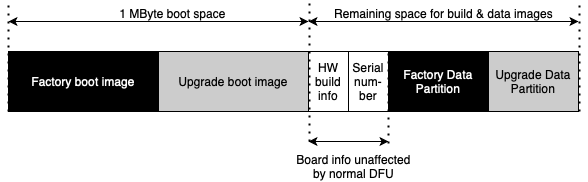

XVF3610 Features and Configuration
==================================

This section describes in detail the features and configuration of the
XVF3610 voice processor. It is organised into four sections which cover
the main aspects of usage and configuration:

-  Booting;

-  Configuration and the Data Partition;

-  Interfaces, Audio Routing and filtering;

-  Far-field voice processing.

Booting
-------

As demonstrated with the VocalFusion development kits the standard
mechanism for booting is from an attached QSPI Flash device. This
provides standalone operation, and persistent storage for configuration
data. VocalFusion XVF3610 supports device firmware upgrade (DFU) over
USB (-UA product variant) and I\ :sup:`2`\ C (-INT product variant).
Pre-compiled host utilities, and source code for reference, are supplied
for performing DFU operations. The pre-compiled utilities can be found
in the release package in one of the host architecture directories eg.
host\Win32\bin\dfu_usb.exe, and the source code in host\src\dfu.

NOTE: While the functionality of the DFU is similar to the USB DFU
specification, it has diverged to accommodate both USB and I2C operation
and therefore is not compatible with compliant USB DFU tools.

The following sections discuss the structure of data within the flash
memory, and operation of DFU.

Flash storage structure
~~~~~~~~~~~~~~~~~~~~~~~

The structure of data within the VocalFusion XVF3610 is arranged to
contain a factory image, a single upgrade image, device serial numbers
and data partitions for both the factory and upgrade image. This is
shown below.

    Flash data structure for VocalFusion XVF3610

-  The **factory boot image** is the executable code for VocalFusion and
   is supplied in the Release Package in the bin directory. The file
   format is xe, which refers to XMOS Executable. This is written to
   the device via the XTAG debugger or through a bulk flash
   programming operation.

-  The **upgrade boot image**, if present, is the executable code
   written to the flash memory via a DFU operation. Generation of the
   upgrade boot image is covered below.

-  The **HW build info** is specified in the .json Data Partition file
   for the factory image and is written at the same time as the
   factory image and Data Partition. It is a unique identifier which
   is unaffected by subsequent DFU upgrade operations.

-  The **Serial Number** is a custom field which can be programmed via
   USB and I2S control interfaces and remains untouched by the
   subsequent DFU operations.

-  The **Factory and Upgrade Data Partitions** are the associated Data
   Partitions for the Factory and Upgrade images (where upgrade is
   present). They are written to flash in the same operation as the
   boot images. For more information on the generation and usage of
   Data Partitions see *Configuration and the Data Partition*
   section.

NOTE: Storage of only a single upgrade boot image and Data Partition
pair are supported. Therefore, any Upgrade image applied will overwrite
any existing upgrade image present.

A summary of the factory programming and field update process for
flash-based systems is shown in the *Appendix I: Flash programming and
update flow.*

Programming the Factory Boot image and Data Partition
~~~~~~~~~~~~~~~~~~~~~~~~~~~~~~~~~~~~~~~~~~~~~~~~~~~~~

The process to program the Factory Boot image and Data Partition is
described in the *Updating the firmware* section.

Upgrade Images and Data Partitions
~~~~~~~~~~~~~~~~~~~~~~~~~~~~~~~~~~

In order to be able to apply an Upgrade image to the device it must be
programmed with a Factory Image and Data Partition as described above.

The DFU process requires the use of two utilities, dfu_usb or dfu_i2c,
depending on the firmware variant, and dfu_suffix_generator. Precompiled
versions are provided as part of the Release Package in the appropriate
platform directory in \\host (eg. \\host\Win32\bin), and the source code
for the DFU utility is provided in the \\host\src\dfu directory. For
more information on building the host applications refer to the build
instruction file in \\host\how_to_build_host_apps.rst in the Release
Package.

In addition to the DFU utilities, the Upgrade image and Data Partition
are required. These are provided in the Release Package in the \\bin and
\\data-partition\images. Generation of custom Data Partitions is
detailed in the *Configuration and the Data Partition* section. There
are a number of stages required to prepare and execute a DFU to ensure
are safe and successful update. These are detailed below.

Generation of Binary Upgrade image
''''''''''''''''''''''''''''''''''

First, the Upgrade Image (.xe) needs to be converted to a binary format.
Use xflash and the following command to convert the .xe image into a
binary form  (note multiple lines have been used for clarity in command
examples, but should be executed on single line):

.. code-block:: bash

  xflash --no-compression --noinq --factory-version 14.3 --upgrade [UPGRADE_VERSION] [UPGRADE_EXECUTABLE] -o [OUTPUT_BINARY_NAME]

Even though the latest and recommended version of the tools is version
14.4.x, for legacy reasons we specify --factory-version value of 14.3.
(The 14.3 value refers to boot loader API while 14.4 is toolchain
version that retained the 14.3 API.)

.. note::

   Should a different version of the tools be used, for example a
   future release, the version number should be noted such that an update
   image of compatible format can be created.

The upgrade version number is specified with --upgrade. The format is as
follows 16bit 0xJJMP where J is major, M is minor and P is point.

For example, to create an upgrade Binary image for a -UA system, from
the v4.0.0 Release Package use the following command:

.. code-block:: bash

  xflash --no-compression --noinq --factory-version 14.3 --upgrade 0x0400 app_xvf3610_ua_v4.0.0.xe -o app_xvf3610_ua_v4.0.0.bin

Addition of DFU Suffix to Binary files
''''''''''''''''''''''''''''''''''''''

To prevent accidental upgrade of an incompatible image both the binary
Upgrade image and the Data Partition binary must be signed using the
provided dfu_suffix_generator which can be found pre-compiled in the
host platform directory of the release package eg. \\host\MAC\bin.

This mechanism embeds a structure into the binary files which can be
read by the DFU tool to check that the binary data is appropriate for
the connected device, prior to executing.

The general form of usage for the dfu_suffix_generator is as follows:

.. code-block::

   dfu_suffix_generator VENDOR_ID PRODUCT_ID [BCD_DEVICE] BINARY_INPUT_FILE BINARY_OUTPUT_FILE

``VENDOR_ID``, ``PRODUCT_ID`` and ``BCD_DEVICE`` are non-zero 16bit values decimal
or hexadecimal format, ``0xFFFF`` bypassing verification of this field.

When building Upgrade images for XVF3610-UA devices, the USB Vendor
Identifier (VID) and USB Product Identifier (PID) are added to the
header and then checked by the DFU utility that the connected device
matches. An error is reported by the tool if there is no match with the
connected device.

For XVF3610-INT devices both Vendor and Product ID fields should be set
to 0xFFFF for the generation. This instructs the DFU to bypass the
checking as there is no equivalent to the USB identifiers for I2C
systems. However, even though the checking is bypassed for the
XVF3610-INT the suffix must be added to both Upgrade and Data partition
files as the DFU utility checks the integrity of the binaries based on
this information.

The following examples show how to add DFU Suffix to Update binaries for
both XVF3610-INT and XVF3610-UA products.

For XVF3610-UA (default XMOS Vendor and XVF3610-UA product identifiers
are used for illustration):

.. code-block::

   dfu_suffix_generator.exe 0x20B1 0x0014 app_xvf3610_ua_v4.0.0.bin boot.dfu

   dfu_suffix_generator.exe 0x20B1 0x0014 data_partition_upgrade_ua_v4_0_0.bin data.dfu

For XVF3610-INT:

.. code-block::

    dfu_suffix_generator.exe 0xFFFF 0xFFFF app_xvf3610_int_v4.0.0.bin boot.dfu

    dfu_suffix_generator.exe 0xFFFF 0xFFFF data_partition_upgrade_int_v4_0_0.bin data.dfu

.. warning::

  Extreme care must be taken if modifying the default Vendor and
  Product IDs through a Data Partition. If configuration from Data
  Partition fails the USB VID and PID will remain at their default values
  (VID=0x20B1, PID=0x0014) and DFU requests for signed files with modified
  will not be allowed.

Performing DFU
''''''''''''''

The pre-compiled DFU utility is provided in the Release Package in the
host architecture directory eg. \\host\Linux\bin. For MAC, Linux and
Windows the DFU_USB is provided, and for PI DFU_I2C is provided. The
source code can be used to rebuild either version on the required
platform.

The general form of dfu_usb utility is as follows:

.. code-block::

    dfu_usb [OPTIONS] write_upgrade BOOT_IMAGE_BINARY DATA_PARTITION_BIN

OPTIONS: --quiet

--vendor-id 0x20B1 (default)

--product-id 0x0014 (default)

--bcd-device 0xFFFF (default)

--block-size 128 (default)

and the general form of the dfu_i2c utility is shown below:

.. code-block::

    dfu_i2c [OPTIONS] write_upgrade BOOT_IMAGE_BINARY DATA_PARTITION_BIN

OPTIONS: --quiet

--i2c-address 0x2c (default)

--block-size 128 (default)

The two binary files passed to the utility, the boot image and data
partition, must have the DFU suffix present otherwise the DFU utility
will generate an error. Example DFU utility usage is shown for both
XVF3610-UA and XVF3610-INT below.

For XVF3610-UA:

.. code-block::

    dfu_usb --vendor-id 0x20B1 --product-id 0x0014 write_upgrade boot.dfu data.dfu

and for XVF3610-INT:

.. code-block::

    dfu_i2c write_upgrade boot.dfu data.dfu

Once complete the following message will be returned and the device will
reboot. In the case of XVF3610-UA the device will re-enumerate.

.. code-block::

    write upgrade successful

For verification that DFU has succeeded as planned, the ``vfctrl`` utility
can be used to query the firmware version before and after update. For
example, to query the version of XVF3610-UA the following command is
used:

.. code-block::

    vfctrl_usb GET_VERSION

NOTE: The ``vfctrl`` utilities check the version number of the connected
device to ensure correct operation. To suppress an error caused by a
disparity in the version of ``vfctrl`` and upgraded firmware the
``--no-check-version`` option can be used with the utility.

Factory restore
~~~~~~~~~~~~~~~

To restore the device to its factory configuration, effectively
discarding any upgrades made, the same process as outlined above is
followed but using a blank Boot Image and Data Partition.

This is the only way a restore can be initiated as the device does not
have the ability to restore itself.

The same blank file can be used for both Boot Image and Data partition
and can be generated using ``dd`` on MAC and Linux, and ``fsutil`` in windows as
shown below:

An blank image can be created with a file of zeroes the size of one
flash sector. In the normal case of 4KB sectors on a UNIX-compatible
platform, this can be created as follows:

.. code-block::

    dd bs=4096 count=1 < /dev/zero 2>/dev/null blank.dfu

and for Windows systems:

.. code-block::

    fsutil file createNew blank.dfu 4096

The process outlined in the *Generation and application of Upgrade Image
and Data Partition* section can now be followed using the blank.dfu file
for both Boot Image and Data Partition.

Boot Image and Data Partition Compatibility checks
~~~~~~~~~~~~~~~~~~~~~~~~~~~~~~~~~~~~~~~~~~~~~~~~~~

The format of Data Partitions and Boot Images may change between version
increments. Therefore to prevent incompatible Boot and Data Partitions
from running and causing undefined behaviour, a field called
compatibility version is embedded into the Data Partition. A running
Boot Image checks its own version, against the compatibility version in
the Data Partition before reading the partition data.

The version of the firmware should also be specified in the ``--upgrade``
argument of ``xflash`` when generating the Upgrade Image as described
previously.

If the compatibility check fails, the booted image, which could be a
factory image or an upgrade image will not read the Data Partition and
will operate with its default settings (described in Default Operation
section above). The Boot status is reported in the RUN_STATUS register
which can be accessed via the ``vfctrl`` utility, for example:

.. code-block::

    vfctrl_usb.exe GET_RUN_STATUS

Successful Boot status is reported by either FACTORY_DATA_SUCCESS or
UPGRADE_DATA_SUCCESS depending on which Boot Image was executed.

If unsuccessful the device will revert to a fail-safe mode of operation.
The RUN_STATUS register can be queried for further debug information.
The full list of RUN_STATUS codes are described in the *Appendix B: Boot
Status codes (RUN_STATUS).*

.. note::

   Fail safe mode uses default vendor ID of 0x20B1 (XMOS) and product
   ID of 0x14. In this event, host needs to be equipped with the ability to
   locate USB device under different IDs.

Custom flash memory devices
~~~~~~~~~~~~~~~~~~~~~~~~~~~

The majority of QSPI flash devices conform to the same set of parameters
which define the access and usage of flash devices. However, to support
instances when the flash interface parameters are different, the
following section explains how to define a custom flash interface.

Details of the flash device used to store the Boot Image and Data
Partition data must be specified in two locations to ensure successful
Factory programming and the ability to execute DFU to Upgrade the
firmware. The Development kit uses a standard QSPI flash device which is
representative of most 2MByte QSPI devices.

Custom flash definition for factory programming
'''''''''''''''''''''''''''''''''''''''''''''''

During the Factory programming procedure, using the XMOS XTAG debugger,
the specification of the flash device is used to create the loader which
is responsible for downloading the Boot Image from flash and to the
device. The flash specification is provided to XFLASH, as described in
the *Updating the Firmware* section, using a SPISPEC file. A
representative SPISPEC file, which supports the majority of QSPI flash
devices and the Development Kits is provided in the Release Package
here:

\\data-partition\16mbit_12.5mhz_sector_4kb.spispec

This is a text file and must be modified with any differing parameters.
An example .spispec file is shown in *Appendix C: Example .SPISPEC File
Format* section.

Custom flash definition for Data Partition generation
'''''''''''''''''''''''''''''''''''''''''''''''''''''

The SPISPEC file must also be included in the Data Partition, along with
the Sector size so that DFU operations can be executed correctly.

NOTE: Due to the nature of the DFU function, it is critically important
to test the execution of the DFU process in a target system prior to
production manufacturing.

SPI Slave Boot
~~~~~~~~~~~~~~

This process was changed from V4.1 of the firmware

Both -UA and -INT configurations of XVF3610 have an SPI slave boot mode,
in addition to the boot from flash mode. The SPI slave boot downloads
the boot image in binary form, provided in the Release Package. This is
illustrated using a Raspberry Pi and the Python script to manage the
transfer as discussed below.

SPI Boot of XVF3610-INT using Development Kit and Raspberry Pi
''''''''''''''''''''''''''''''''''''''''''''''''''''''''''''''

Using the Development Kit, assembled as described in section
*XVF3610-INT Amazon AVS demonstration*, and the XVF3610-INT Release
Package available on the Raspberry Pi, a SPI boot can be executed by
following the steps below:

#.  Using a terminal console on the Raspberry Pi, navigate to the
    location of the XVF3610-INT Release Package.

#.  Use the following command to execute the SPI boot process booting
    the XVF3610-INT firmware in the Release Package (replacing vX_X_X with the appropriate version number):

    .. code-block:: bash

        python3 host/Pi/scripts/send_image_from_rpi.py bin/app_xvf3610_int_spi_boot_vX_X_X.bin --delay

The device should be ready within 3 seconds.

#.  Update the main clock in to PDM clock specific using the
    VocalFusion Control Utility ``vfctrl_i2c``:

    .. code-block:: bash

      ./host/Pi/bin/vfctrl_i2c SET_MCLK_IN_TO_PDM_CLK_DIVIDER 1

#. Configure any system specific settings using the VocalFusion
   Control Utility ``vfctrl_i2c``.

#. Start the XVF3610 processing and interfaces by issuing the
   following commands over the VocalFusion control utility:

   .. code-block:: bash

      ./host/Pi/bin/vfctrl_i2c SET_MIC_START_STATUS 1

      ./host/Pi/bin/vfctrl_i2c SET_I2S_START_STATUS 1

.. note::

   Following an SPI boot the XVF3610 will not read any Data Partition
   that may be present in flash memory. This is the reason why step 3 is
   necessary, the command SET_MCLK_IN_TO_PDM_CLK_DIVIDER is included in the
   Data Partition for XVF3610-INT.

SPI Boot of XVF3610-UA using Development Kit and Raspberry Pi
'''''''''''''''''''''''''''''''''''''''''''''''''''''''''''''

NOTE: To illustrate the SPI Boot of XVF3610-UA on the development kit
custom connection must be made between Pi Hat and XVF3610 Processor
board. The connection is discussed in more detail in *Appendix D: SPI
Boot custom connection.*

Using the XVF3610-UA Release Package available on the Raspberry Pi, a
SPI boot can be executed by following the steps below:

#. Using a terminal console on the Raspberry Pi, navigate to the
   location of the XVF3610-UA Release Package.

#. Use the following command to execute the SPI boot process booting
   the XVF3610-UA firmware in the Release Package (replacing vX_X_X with
   the appropriate version number):

   .. code-block:: bash

       python3 host/Pi/scripts/send_image_from_rpi.py bin/app_xvf3610_ua_spi_boot_vX_X_X.bin --delay

The device should be boot within 3 seconds.

.. note::

	The delay start mode is not available for XVF3610-UA.

Configuration and the Data Partition
------------------------------------

As described in a previous section, when using flash to boot the XVF3610
processor, the Data partition can be used to store commands which are
executed immediately after boot-up to configure and define the
functionality of the device. The following sections describe the
definition of the Data Partition, how to generate, and the customisation
for specific applications.

Data Partition definition
~~~~~~~~~~~~~~~~~~~~~~~~~

Partition file structure
''''''''''''''''''''''''

The contents of a Data Partition are defined in a .json file which is
passed to a generation script which forms the binary files used when
flashing the device. The generation process is described below, after
the definition .json file is described.

For the purpose of explanation consider the following example for a
custom XVF3610-UA Data Partition:

.. code-block:: JSON

    {
    "comment": "",
    "spispec_path": "16mbit_12.5mhz_sector_4kb.spispec",
    "regular_sector_size": "4096",
    "hardware_build": "0xFFFFFFFF",
    "item_files": [
        { "path": "input/usb_to_device_rate_48k.txt", "comment": "" },
        { "path": "input/device_to_usb_rate_48k.txt", "comment": "" },
        { "path": "input/usb_mclk_divider.txt", "comment": "" },
        { "path": "input/xmos_usb_params.txt", "comment": "" },
        { "path": "input/i2s_rate_16k.txt", "comment": "" },
        { "path": "input/led_after_boot.txt", "comment":"" }
      ]
    }

Comment pairs are provided for the .json configuration, but also the
individual item files:

.. code-block:: JSON

    { "comment": "" }

A running VocalFusion device needs to know size and geometry of its
external QSPI flash in order to write firmware upgrades to it. This is
added to a Data Partition in the form of a flash specification or SPI
specification (See Appendix C for custom flash support)

.. code-block:: JSON

    { "spispec_path": "16mbit_12.5mhz_sector_4kb.spispec" }

The Data Partition generation process aligns various sections onto flash
sectors, and needs to know the sector size (this can be found in the
flash device datasheet):

.. code-block:: JSON

    { "regular_sector_size": "4096" }

Hardware build is a custom-defined, 32bit identifier written to flash
along with the application firmware. It can be used to define a unique
identifier for the hardware revision or other information which cannot
be overwritten by subsequent updates:

.. code-block:: JSON

    { "hardware_build": "0xFFFFFFFF" }

Item files which contain the commands to execute (format of item files
described below). An optional comment field is provided:

.. code-block:: JSON

    { "path": "input/usb_to_device_rate_48k.txt", "comment": "" }

.. note::

   Because the generator is a Python script, the paths uses forward
   slashes irrespective of platform.

Item files
''''''''''

The item files contain the commands used to configure the system. The
commands are simply added to the file in the same format as the command
line control utility. For clarity, multiple item files can be included
in the .json definition, each specifying a sub-set of commands relating
to a particular function or aspect. Example item files for common
configurations are provided in the data-partition/input directory of the
release package. For example, the agc_bypass.txt item file bypasses the
AGC for both output channels contains the following commands:

.. code-block:: bash

    SET_ADAPT_CH0_AGC 0
    SET_ADAPT_CH1_AGC 0
    SET_GAIN_CH0_AGC 1
    SET_GAIN_CH1_AGC 1

Generating a Data Partition for custom applications
~~~~~~~~~~~~~~~~~~~~~~~~~~~~~~~~~~~~~~~~~~~~~~~~~~~

It is recommended that in order to create a custom Data Partition, an
existing set of .json and item files is used as a template and modified
as required. The release package contains example .json and item files
for this purpose.

NOTE: The following process requires the use of Python 3. Installation
is covered in *Required Tools* section.

The required additional control commands should be stored in an
appropriately named text file inside the ``data-partition/input``
subdirectory. For example, a file named ``aec_bypass.txt`` could be added
containing the collected commands:

.. code-block:: bash

    SET_BYPASS_AEC 1

NOTE: Only commands which are required to be set with non-default values
need to be included in the item file list.

These text files are then included in the custom JSON description.

In the above example, the ``aec_bypass.txt`` is added to to a JSON
description, ``bypass_AEC.json`` as shown below:

.. code-block:: JSON

    "item_files": [
          {
        "path": "input/aec_bypass.txt",
        "comment": "bypass AEC processing"
          }
        ]

.. note::

    The execution order of the commands and input files can affect
    the behaviour of the device. Commands to configure USB and I2S
    should be added at the beginning of the data image.**

Finally, to generate the custom data partition, the command below should
be run from the data-partition directory:

.. code-block:: bash

    python3 xvf3610_data_partition_generator.py <build_type>.json

The generator script produces two data image files; one for factory
programming and one for device upgrade in a directory named output.

For the above example these files will be called:

``data_partition_factory_<build_type>.bin``

and

``data_partition_upgrade_<build_type>.bin``.

These two binary files can be used to factory program or upgrade as
described in *Updating the firmware* and *Generation and application of
Upgrade Image and Data Partition* sections respectively.

A .JSON file is also produced for debugging purposes.

Serial Number
~~~~~~~~~~~~~

The XVF3610 allows a 24 ASCII character long serial number to be stored
in the external flash memory. This can be accessed using the VocalFusion
Control application using the following commands (XVF3610-INT shown for
example). To write to the serial number register use:

.. code-block:: bash

    vfctrl_i2c SET_SERIAL_NUMBER "DEADBEEF"

and to read use:

.. code-block:: bash

    vfctrl_i2c GET_SERIAL_NUMBER

USB device enumeration (XVF3610-UA only)
''''''''''''''''''''''''''''''''''''''''

The XVF3610-UA additionally allows the Serial Number to be copied into
the iSerialNumber field of the USB descriptor. As the host reads the USB
descriptor on enumeration the command to copy the serial number must be
present in the Data Partition. To illustrate this process the following
commands must be incorporated into a Data Partition in the specified
order (example assumes SERIAL_NUMBER field is already populated).

To set the USB configuration to use the serial number in the descriptor
add the following lines, in this order, to the Data Partition:

.. code-block::

    SET_USB_SERIAL_NUMBER 1

To set the USB configuration to start enumeration:

.. code-block::

    SET_USB_START_STATUS 1
