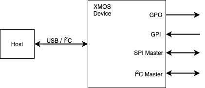
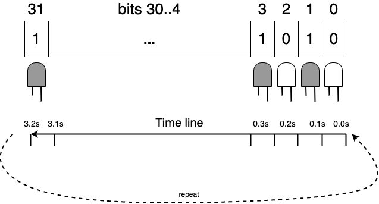
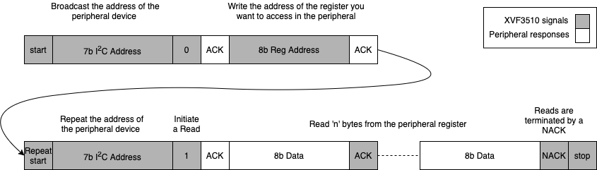
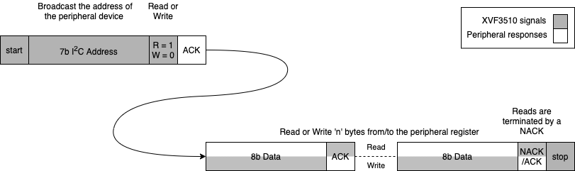
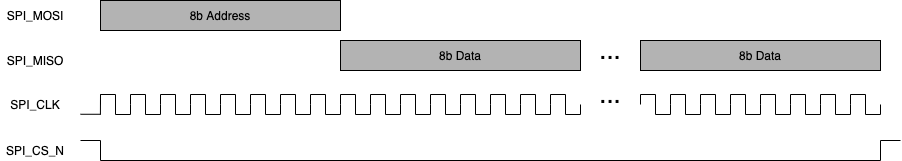
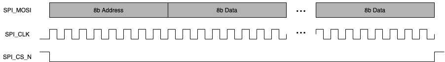

I2C Slave Control interface (XVF3610-INT only)
~~~~~~~~~~~~~~~~~~~~~~~~~~~~~~~~~~~~~~~~~~~~~~

The XVF3610-INT implements an I2C slave interface for Control and Setup
of the device. The interface conforms to the following specifications.

+-----------------------------------------------------+----------------+
| Specification                                       | Value          |
+=====================================================+================+
| Maximum I2C operation speed                         | 100kbps        |
+-----------------------------------------------------+----------------+
| I2C Slave Address                                   | 0x2C           |
+-----------------------------------------------------+----------------+

General Purpose Input and Output and Peripheral Bridging
~~~~~~~~~~~~~~~~~~~~~~~~~~~~~~~~~~~~~~~~~~~~~~~~~~~~~~~~

The XVF3610 supports I/O expansion and protocol bridging over USB and
I2C for the XVF3610-UA and XVF3610-INT respectively. This allows
peripheral devices such as audio hardware connected to XVF3610 to be
configured and monitored by the host.

  Device GPIO interfaces

-  Four GPI channels (pins)

-  Direct read of port value

-  Rising, falling or both edge capture with “sticky” bit which is cleared on read

-  Mode configurable per pin

-  Four GPO channels (pins)

-  Direct write of entire port or pin

-  Active high or Active low

-  500Hz PWM configurable between 0 and 100% duty

-  Blinking control supporting a sequence of 32, 100ms states

-  SPI Master

-  1Mbps SPI clock

-  Up to 128 Bytes SPI write

-  Up to 56 Bytes SPI read

-  I2C Master (XVF3610-UA only)

-  100kbps SCL clock speed

-  Register read/write (byte)

-  Up to 56 byte I2C read/write

The following sections describe the configuration and usage of each
peripheral interface.

GPIO
~~~~

There are four general input and four general output pins provided on
the XVF3610.

.. table:: GPIO pin table

  +-------------+----------------------------------------------+--------+
  | Name        | Description                                  | I/O    |
  +=============+==============================================+========+
  | IP_0        | General purpose input                        | I      |
  +-------------+----------------------------------------------+--------+
  | IP_1        | General purpose input                        | I      |
  +-------------+----------------------------------------------+--------+
  | IP_2        | General purpose input                        | I      |
  +-------------+----------------------------------------------+--------+
  | IP_3        | General purpose input                        | I      |
  +-------------+----------------------------------------------+--------+
  | OP_0        | General purpose output                       | O      |
  +-------------+----------------------------------------------+--------+
  | OP_1        | General purpose output                       | O      |
  +-------------+----------------------------------------------+--------+
  | OP_2        | General purpose output                       | O      |
  +-------------+----------------------------------------------+--------+
  | OP_3        | General purpose output                       | O      |
  +-------------+----------------------------------------------+--------+

General Purpose Inputs
''''''''''''''''''''''

The following commands are available to read and control GPIs. Note that
interrupt registers are set to 1 when an edge has been detected and 0
when no event has occurred. All interrupt registers are initialised to 0
on boot.

IP_0 is special in that, when interrupts are enabled, they are
automatically serviced inside the chip and an HID report is generated
over USB accordingly. See the *USB HID* section for further details.

The following parameters are available to interrogate and configure the
GPI behaviour.

.. table:: General Purpose Input commands

  +------------------+----+----+----+-----------------------------------+
  | Command          | Ty | d  | Ar | Description                       |
  |                  | pe | ir | gs |                                   |
  +==================+====+====+====+===================================+
  | GET_GPI          | ui | RE | 1  | Read current level of all pins of |
  |                  | nt | AD |    | the selected GPIO port. Pin 0     |
  |                  | 32 |    |    | corresponds to the LSB of the     |
  |                  |    |    |    | port.                             |
  +------------------+----+----+----+-----------------------------------+
  | GET_GPI          | ui | RE | 1  | Read whether interrupt was        |
  | _INT_PENDING_PIN | nt | AD |    | triggered for selected pin. The   |
  |                  | 32 |    |    | interrupt pending register for    |
  |                  |    |    |    | the selected pin is cleared by    |
  |                  |    |    |    | this command.                     |
  +------------------+----+----+----+-----------------------------------+
  | GET_GPI_INT      | ui | RE | 1  | Read whether interrupt was        |
  | _PENDING_PORT    | nt | AD |    | triggered for all pins on         |
  |                  | 32 |    |    | selected port. The interrupt      |
  |                  |    |    |    | pending register for the whole    |
  |                  |    |    |    | port is cleared by this command.  |
  +------------------+----+----+----+-----------------------------------+
  | SET_GPI_PIN      | u  | W  | 3  | Set the active level for a        |
  | _ACTIVE_LEVEL    | in | RI |    | specific GPI pin. Arguments are   |
  |                  | t8 | TE |    | <Port Index> <Pin Index> <0:      |
  |                  |    |    |    | active low, 1: active high>. By   |
  |                  |    |    |    | default, all GPI pins are set to  |
  |                  |    |    |    | active high.                      |
  +------------------+----+----+----+-----------------------------------+
  | SE               | u  | W  | 3  | Sets the interrupt config         |
  | T_GPI_INT_CONFIG | in | RI |    | for a specific pin. Arguments are |
  |                  | t8 | TE |    | <Port Index> <Pin Index>          |
  |                  |    |    |    | <Interrupt type 0=None,           |
  |                  |    |    |    | 1=Falling, 2=Rising, 3=Both>.     |
  +------------------+----+----+----+-----------------------------------+
  | SET              | u  | W  | 2  | Sets the selected port and pin    |
  | _GPI_READ_HEADER | in | RI |    | for the next GPIO read. Arguments |
  |                  | t8 | TE |    | are <Port Index> <Pin Index>.     |
  +------------------+----+----+----+-----------------------------------+
  | GET              | u  | RE | 2  | Gets the currently selected port  |
  | _GPI_READ_HEADER | in | AD |    | and pin set by a previous         |
  |                  | t8 |    |    | SET_GPI_READ_HEADER command.      |
  +------------------+----+----+----+-----------------------------------+
  | SET_K            | u  | W  | 1  | Set gpi pin index to receive kwd  |
  | WD_INTERRUPT_PIN | in | RI |    | interrupt on                      |
  |                  | t8 | TE |    |                                   |
  +------------------+----+----+----+-----------------------------------+
  | GET_K            | u  | RE | 1  | Read gpi pin index to receive kwd |
  | WD_INTERRUPT_PIN | in | AD |    | interrupt on                      |
  |                  | t8 |    |    |                                   |
  +------------------+----+----+----+-----------------------------------+

Example: reading a GPIO pin
'''''''''''''''''''''''''''

For example, a read operation on XVF3610-UA is illustrated below. To
read the level of pin 2 of the input port first set the port index
(always 0 for XVF3610) and the pin index (2 in this case):

vfctrl_usb SET_GPI_READ_HEADER 0 2

Next perform the read:

vfctrl_usb GET_GPI

GET_GPI: 13

The returned value, 13 (b‘1101), means pin index 1 (IP_1) is logic low
and the other pins 0, 2 and 3 logic high.

Example: Configuring and capturing a falling and rising edge interrupt
''''''''''''''''''''''''''''''''''''''''''''''''''''''''''''''''''''''

An example of configuration of a GPIs to capture edge events is
discussed below (XVF3610-INT used for the example). First, configure
IP_1 to trigger a falling edge interrupt and IP_2 to trigger a rising
edge interrupt as shown:

vfctrl_i2c SET_GPI_INT_CONFIG 0 1 1

vfctrl_i2c SET_GPI_INT_CONFIG 0 2 2

For the example, IP_1 & IP_2 are connected to the same source, which is
driving low. To check the ports for interrupts use the following
commands:

vfctrl_i2c SET_GPI_READ_HEADER 0 0

vfctrl_i2c GET_GPI_INT_PENDING_PORT

> GET_GPI_INT_PENDING_PORT: 0

NOTE: The pin index specified in SET_GPI_READ_HEADER is ignored by
GET_GPI_INT_PENDING_PORT

The result returned by the GET_GPI_INT_PENDING_PORT indicates that no
transitions have occurred. Continuing the example, assume now that IP_1
& IP_2 are asserted high, and the port queried again:

vfctrl_i2c GET_GPI_INT_PENDING_PORT

> GET_GPI_INT_PENDING_PORT: 2

The result 2 (b‘0010) shows that IP_2 has triggered on a rising edge.
Rechecking the port status shows this event has been cleared.

vfctrl_i2c GET_GPI_INT_PENDING_PORT

> GET_GPI_INT_PENDING_PORT: 0

When IP_1 and IP_2 are driven low and the port status queried again:

vfctrl_i2c GET_GPI_INT_PENDING_PORT

> GET_GPI_INT_PENDING_PORT : 1

result ( b‘0001 ) shows that IP_1 has seen a falling edge interrupt.

General Purpose Outputs
'''''''''''''''''''''''

The following commands are available to write and control GPOs:

.. table:: General Purpose Output commands

  +------------------+----+--------+----+-------------------------------+
  | Command          | Ty | Dir    | Ar | Description                   |
  |                  | pe | ection | gs |                               |
  +==================+====+========+====+===============================+
  | SET_GPO_PORT     | ui | WRITE  | 2  | Write a value to all pins of  |
  |                  | nt |        |    | a GPIO port. Arguments are    |
  |                  | 32 |        |    | <Port Index> <Value>.         |
  +------------------+----+--------+----+-------------------------------+
  | SET_GPO_PIN      | u  | WRITE  | 3  | Write to a specific GPIO pin. |
  |                  | in |        |    | Arguments are <Port Index>    |
  |                  | t8 |        |    | <Pin Index> <Value>.          |
  +------------------+----+--------+----+-------------------------------+
  | SET_GPO_PIN      | u  | WRITE  | 3  | Set the active level for a    |
  | _ACTIVE_LEVEL    | in |        |    | specific GPO pin. Arguments   |
  |                  | t8 |        |    | are <Port Index> <Pin Index>  |
  |                  |    |        |    | <0: active low, 1: active     |
  |                  |    |        |    | high>. By default, all GPO    |
  |                  |    |        |    | pins are active high          |
  +------------------+----+--------+----+-------------------------------+
  | SET_GPO_PWM_DUTY | u  | WRITE  | 3  | Set the PWM duty for a        |
  |                  | in |        |    | specific pin. Value given as  |
  |                  | t8 |        |    | an integer percentage.        |
  |                  |    |        |    | Arguments are <Port Index>    |
  |                  |    |        |    | <Pin Index> <Duty in          |
  |                  |    |        |    | percent>.                     |
  +------------------+----+--------+----+-------------------------------+
  | SET_GPO_FLASHING | ui | WRITE  | 3  | Set the serial flash mask for |
  |                  | nt |        |    | a specific pin. Each bit in   |
  |                  | 32 |        |    | the mask describes the GPO    |
  |                  |    |        |    | state for a 100ms interval.   |
  |                  |    |        |    | Arguments are <Port Index>    |
  |                  |    |        |    | <Pin Index> <Flash            |
  |                  |    |        |    | mask>.                        |
  +------------------+----+--------+----+-------------------------------+

NOTE: All GPOs have a weak pull-down (~30kΩ) during reset and
initialised to logic low on device boot and will always drive the pin
thereafter.

To illustrate usage of the GPOs the following section considers four
common examples. Writing to a GPO pin, configuring a PWM output,
generating a blink sequence and driving a three colour (RGB) LED.

The following commands toggle OP_2 high then low (XVF3610-UA shown for
example):

vfctrl_usb SET_GPO_PIN 0 2 1

vfctrl_usb SET_GPO_PIN 0 2 0

To set all GPOs high and then low:

vfctrl_usb SET_GPO_PORT 0 15

vfctrl_usb SET_GPO_PORT 0 0

The PWM runs at a fixed 500Hz frequency designed to minimise visible
flicker when dimming LEDs and supports 100 discrete duty settings to
permit gradual off to fully-on control.

The following commands illustrate setting individual PWM frequencies on
each output by setting GPO pins 0, 1, 2 and 3 to output 25%, 50%, 75%
and 100% duty cycles respectively:

vfctrl_usb SET_GPO_PWM_DUTY 0 0 25

vfctrl_usb SET_GPO_PWM_DUTY 0 1 50

vfctrl_usb SET_GPO_PWM_DUTY 0 2 75

vfctrl_usb SET_GPO_PWM_DUTY 0 3 100

Setting a pin duty to 100% is the same as setting that pin to high.

Each GPO is driven from the LSB of an internal 32bit register, which is
rotated by one bit every 100mS.

The figure below shows how the blinking sequence works:

  Use of 32 bit word is used to define the blinking function of GPO

The following commands configure the following:

-  GPO pin 0 blinking, ON for 1.6 seconds, then OFF for 1.6 seconds,
     i.e. a period of 3.2 seconds;

-  GPO pin 1 blinking, ON for 0.8 seconds, then OFF for 0.8 seconds,
     i.e. a period of 1.6 seconds;

-  GPO pin 2 blinking, ON for 0.1 seconds, then OFF for 0.1 seconds,
     i.e. a period of 0.2 seconds;

vfctrl_usb SET_GPO_FLASHING 0 0 4294901760 # equivalent to pattern:
xFFFF0000

vfctrl_usb SET_GPO_FLASHING 0 1 4042322160 # equivalent to pattern:
xFF00FF00

vfctrl_usb SET_GPO_FLASHING 0 2 2863311530 # equivalent to pattern:
xAAAAAAAA

Note that a GPO pin can be set to both a PWM duty cycle, and to flashing
by issuing both a GPO_SET_PWM_DUTY instruction and a SET_GPO_FLASHING
instruction for the same port and pin.

Where RGB LEDs are connected to three GPO pins (0 = Red, 1 = Green, 2 =
Blue) automated colour sequencing can be programmed. For example, to
colour cycle between Red-Yellow-Green-Cyan-Blue every 3.2 seconds:

vfctrl_usb SET_GPO_FLASHING 0 0 65535 # 0 x0000FFFF

vfctrl_usb SET_GPO_FLASHING 0 1 16776960 # 0 x00FFFF00

vfctrl_usb SET_GPO_FLASHING 0 2 4294901760 # 0 xFFFF0000

I2C Master peripheral interface (XVF3610-UA Only)
~~~~~~~~~~~~~~~~~~~~~~~~~~~~~~~~~~~~~~~~~~~~~~~~~

The XVF3610-UA variant provides an I\ :sup:`2`\ C master interface which
can be used as:

-  a bridge from the USB interface, i.e. VFCTRL_USB commands can be used
     from the host to read and write devices connected to the
     I\ :sup:`2`\ C Peripheral Port;

-  a mechanism to initialise devices connected to the I\ :sup:`2`\ C
     Peripheral Port by incorporating commands into the data partition
     (in the external flash), which are executed at boot time.

The interface supports:

-  100kbps fixed speed

-  7bit addressing only

-  Byte I\ :sup:`2`\ C register read/writes are supported.

The following table shows the commands for the configuration of the
I\ :sup:`2`\ C Master interface:

.. table:: I2C peripheral interface commands

  +---------------+----+--------+----------+--------+-------------------+
  | Command       | Ty | Dir    | Num of   | Number | Definition        |
  |               | pe | ection | Args     | of     |                   |
  |               |    |        |          | Re     |                   |
  |               |    |        |          | turned |                   |
  |               |    |        |          | values |                   |
  +===============+====+========+==========+========+===================+
  | SET_I2        | u  | WRITE  | 3        | 0      | Set the           |
  | C_READ_HEADER | in |        |          |        | parameters to be  |
  |               | t8 |        |          |        | used by the next  |
  |               |    |        |          |        | GET_I2C, or       |
  |               |    |        |          |        | GET_I2C_WITH_REG  |
  |               |    |        |          |        | command.          |
  |               |    |        |          |        |                   |
  |               |    |        |          |        | | Arguments:      |
  |               |    |        |          |        | | 1: The 7-bit    |
  |               |    |        |          |        |   I2C slave       |
  |               |    |        |          |        |   device address. |
  |               |    |        |          |        | | 2: The register |
  |               |    |        |          |        |   address within  |
  |               |    |        |          |        |   the device.     |
  |               |    |        |          |        | | 3: The number   |
  |               |    |        |          |        |   of bytes to     |
  |               |    |        |          |        |   read.           |
  +---------------+----+--------+----------+--------+-------------------+
  | GET_I2        | u  | READ   | 0        | 3      | Get the           |
  | C_READ_HEADER | in |        |          |        | parameters to be  |
  |               | t8 |        |          |        | used by the next  |
  |               |    |        |          |        | GET_I2C, or       |
  |               |    |        |          |        | GET_I2C_WITH_REG  |
  |               |    |        |          |        | command.          |
  |               |    |        |          |        |                   |
  |               |    |        |          |        | | Returned        |
  |               |    |        |          |        |   values:         |
  |               |    |        |          |        | | 1: The 7-bit    |
  |               |    |        |          |        |   I2C slave       |
  |               |    |        |          |        |   device address. |
  |               |    |        |          |        | | 2: The register |
  |               |    |        |          |        |   address within  |
  |               |    |        |          |        |   the device.     |
  |               |    |        |          |        | | 3: The number   |
  |               |    |        |          |        |   of bytes to     |
  |               |    |        |          |        |   read.           |
  +---------------+----+--------+----------+--------+-------------------+
  | GET_I2C       | u  | READ   | 0        | 56     | Read from an I2C  |
  |               | in |        |          |        | device defined by |
  |               | t8 |        |          |        | the               |
  |               |    |        |          |        | SET               |
  |               |    |        |          |        | _I2C_READ_HEADER  |
  |               |    |        |          |        | command.          |
  |               |    |        |          |        |                   |
  |               |    |        |          |        | Returned          |
  |               |    |        |          |        | values:           |
  |               |    |        |          |        | 1 to 56: The      |
  |               |    |        |          |        | number of bytes   |
  |               |    |        |          |        | read as defined   |
  |               |    |        |          |        | by the            |
  |               |    |        |          |        | SET               |
  |               |    |        |          |        | _I2C_READ_HEADER  |
  |               |    |        |          |        | command           |
  |               |    |        |          |        | followed by       |
  |               |    |        |          |        | additional        |
  |               |    |        |          |        | undefined         |
  |               |    |        |          |        | values. The       |
  |               |    |        |          |        | number of bytes   |
  |               |    |        |          |        | read from the     |
  |               |    |        |          |        | I2C device when   |
  |               |    |        |          |        | executing         |
  |               |    |        |          |        | GET_I2C is set    |
  |               |    |        |          |        | using             |
  |               |    |        |          |        | SET               |
  |               |    |        |          |        | _I2C_READ_HEADER  |
  +---------------+----+--------+----------+--------+-------------------+
  | GET           | u  | READ   | 0        | 56     | Read from the     |
  | _I2C_WITH_REG | in |        |          |        | register of an    |
  |               | t8 |        |          |        | I2C device as     |
  |               |    |        |          |        | defined by the    |
  |               |    |        |          |        | SE                |
  |               |    |        |          |        | T_I2C_READ_HEADER |
  |               |    |        |          |        | command.          |
  |               |    |        |          |        |                   |
  |               |    |        |          |        | Returned          |
  |               |    |        |          |        | values:           |
  |               |    |        |          |        | 1 to 56: The      |
  |               |    |        |          |        | number of bytes   |
  |               |    |        |          |        | read as defined   |
  |               |    |        |          |        | by the            |
  |               |    |        |          |        | SET               |
  |               |    |        |          |        | _I2C_READ_HEADER  |
  |               |    |        |          |        | command           |
  |               |    |        |          |        | followed by       |
  |               |    |        |          |        | additional        |
  |               |    |        |          |        | undefined         |
  |               |    |        |          |        | values. The       |
  |               |    |        |          |        | number of bytes   |
  |               |    |        |          |        | read from the     |
  |               |    |        |          |        | I2C device when   |
  |               |    |        |          |        | executing         |
  |               |    |        |          |        | GET_I2C is set    |
  |               |    |        |          |        | using             |
  |               |    |        |          |        | SET               |
  |               |    |        |          |        | _I2C_READ_HEADER  |
  +---------------+----+--------+----------+--------+-------------------+
  | SET_I2C       | u  | WRITE  | 56       | 0      | Write to an I2C   |
  |               | in |        |          |        | slave device.     |
  |               | t8 |        |          |        |                   |
  |               |    |        |          |        | Arguments:        |
  |               |    |        |          |        | 1: The 7-bit      |
  |               |    |        |          |        | I2C slave         |
  |               |    |        |          |        | device address.   |
  |               |    |        |          |        | 2: The number     |
  |               |    |        |          |        | of data bytes     |
  |               |    |        |          |        | to write (n).     |
  |               |    |        |          |        | 3 to 56: Data     |
  |               |    |        |          |        | bytes. All 54     |
  |               |    |        |          |        | values must be    |
  |               |    |        |          |        | given but only    |
  |               |    |        |          |        | n will be sent.   |
  +---------------+----+--------+----------+--------+-------------------+
  | SET           | u  | WRITE  | 56       | 0      | Write to a        |
  | _I2C_WITH_REG | in |        |          |        | specific register |
  |               | t8 |        |          |        | of an I2C slave   |
  |               |    |        |          |        | device.           |
  |               |    |        |          |        |                   |
  |               |    |        |          |        |  Arguments:       |
  |               |    |        |          |        |  1: The 7-bit     |
  |               |    |        |          |        |  I2C slave        |
  |               |    |        |          |        |  device address.  |
  |               |    |        |          |        |  2: The register  |
  |               |    |        |          |        |  address within   |
  |               |    |        |          |        |  the device.      |
  |               |    |        |          |        |  3: The number    |
  |               |    |        |          |        |  of data bytes    |
  |               |    |        |          |        |  to write (n).    |
  |               |    |        |          |        |  4 to 56: Data    |
  |               |    |        |          |        |  bytes. All 53    |
  |               |    |        |          |        |  values must be   |
  |               |    |        |          |        |  given but only   |
  |               |    |        |          |        |  n will be sent.  |
  +---------------+----+--------+----------+--------+-------------------+

  I2C protocol for register reads

.. figure:: media/image15.png

  I2C protocol for register writes

-  raw I\ :sup:`2`\ C read/writes may be performed.

  I2C protocol for raw reads and writes

Using I2C Master to write to a device
'''''''''''''''''''''''''''''''''''''

Typically byte register read/writes are used to configure external I2C
controlled hardware.

As an example, assume there is a device connected at address 0x40 (64)
with three, single byte, registers. The following commands will write 77
to register 0, 48 to register 1 and 33 to register 2.

vfctrl_usb SET_I2C_WITH_REG 64 0 1 77 0 0 0 0 0 0 0 0 0 0 0 0 0 0 0 0 0

0 0 0 0 0 0 0 0 0 0 0 0 0 0 0 0 0 0 0 0 0 0 0 0 0 0 0 0 0 0 0 0 0 0 0

vfctrl_usb SET_I2C_WITH_REG 64 1 1 48 0 0 0 0 0 0 0 0 0 0 0 0 0 0 0 0 0

0 0 0 0 0 0 0 0 0 0 0 0 0 0 0 0 0 0 0 0 0 0 0 0 0 0 0 0 0 0 0 0 0 0 0

vfctrl_usb SET_I2C_WITH_REG 64 2 1 33 0 0 0 0 0 0 0 0 0 0 0 0 0 0 0 0 0

0 0 0 0 0 0 0 0 0 0 0 0 0 0 0 0 0 0 0 0 0 0 0 0 0 0 0 0 0 0 0 0 0 0 0

NOTE: The control protocol does not support variadic (variable number
of) arguments. Hence, even when writing a single byte, the full number
of arguments must bepassed. Unwritten values are ignored.

Using the I2C master to read from a device
''''''''''''''''''''''''''''''''''''''''''

| To verify the previous I\ :sup:`2`\ C register write to register
 number 0 at address
| 0x40 (64), an I\ :sup:`2`\ C register read can be performed as
 follows:

vfctrl_usb SET_I2C_READ_HEADER 64 0 1

vfctrl_usb GET_I2C_WITH_REG

> 77 0 0 0 0 0 0 0 0 0 0 0 0 0 0 0 0 0 0 0 0 0

0 0 0 0 0 0 0 0 0 0 0 0 0 0 0 0 0 0 0 0 0 0 0 0 0 0 0 0 0 0 0 0 0 0

The byte read is the first of the 56 return values, which in this case,
is 77. The following 55 values are undefined since the command only
performed a read of 1 register.

SPI Master
~~~~~~~~~~

The XVF3610_UA and XVF3610-INT variants provide an SPI master interface
which can be used as:

-  a bridge from the USB interface, i.e. VFCTRL_USB commands can be used
     from the host to read and write devices connected to the SPI
     Peripheral Port; and

-  a mechanism to initialise devices connected to the SPI Peripheral
     Port by incorporating commands into the data partition (in the
     external flash), which are executed at boot time.

NOTE: From Version 4.1 the SPI Master peripheral interface is not
available on XVF3610_UA and XVF3610_INT devices that have been SPI
booted to prevent possible bus contention issues

The SPI master peripheral supports the following fixed specifications:

-  Single chip select line

-  1Mbps fixed clock speed

-  Supports either reads or writes. Duplex read/writes are not
     supported.

-  Most significant bit transferred first

-  Mode 0 transfer (CPOL = 0, CPHA = 0)

NOTE: The chip select is asserted a minimum of before 20ns the start of
the transfer and de-asserted a minimum of 20ns after the transfer ends.

The SPI Master is controlled using the following commands.

.. table:: SPI peripheral interface commands

  +----------------+----+----+----+-------------------------------------+
  | Command        | Ty | d  | Ar | Description                         |
  |                | pe | ir | gs |                                     |
  +================+====+====+====+=====================================+
  | GET_SPI        | u  | RE | 56 | Gets the contents of the SPI read   |
  |                | in | AD |    | buffer.                             |
  |                | t8 |    |    |                                     |
  +----------------+----+----+----+-------------------------------------+
  | GET_S          | u  | RE | 2  | Get the address and count of next   |
  | PI_READ_HEADER | in | AD |    | SPI read.                           |
  |                | t8 |    |    |                                     |
  +----------------+----+----+----+-------------------------------------+
  | SET_SPI_PUSH   | u  | W  | 56 | Push SPI command data onto the      |
  |                | in | RI |    | execution queue.                    |
  |                | t8 | TE |    |                                     |
  +----------------+----+----+----+-------------------------------------+
  | SET_SPI        | u  | W  | 56 | Push SPI command data and execute   |
  | _PUSH_AND_EXEC | in | RI |    | the command from the stack. Data    |
  |                | t8 | TE |    | will then be sent to SPI device.    |
  +----------------+----+----+----+-------------------------------------+
  | SET_S          | u  | W  | 2  | Set address and count of next SPI   |
  | PI_READ_HEADER | in | RI |    | read.                               |
  |                | t8 | TE |    |                                     |
  +----------------+----+----+----+-------------------------------------+

Reads of up to 56 Bytes at a time may be performed but writes of 128
Bytes at a time can be made by pushing multiple commands into a command
stack and executing them in one go. The transaction is performed within
a single chip select assertion.

  SPI peripheral, read sequence

  SPI peripheral, write sequence

The control protocol does not support variadic (variable number of)
arguments. Hence, even when writing a single byte, the total number of
arguments passed must be the maximum. Unwritten values are ignored.

See below examples.

The following example writes one byte of data (with value 122) to a
control register as address 6.

vfctrl_i2c SET_SPI_PUSH_AND_EXEC 0 0 0 0 0 0 0 0 0 0 0 0 0 0 0 0 0 0 0

0 0 0 0 0 0 0 0 0 0 0 0 0 0 0 0 0 0 0 0 0 0 0 0 0 0 0 0 0 0 0 0

0 0 6 1 122

NOTE: All numbers are decimal. It is necessary to pad the payload to 56
bytes, which includes the address, length and data values. This is a
requirement of the VFCTRL tool, the SPI interface itself will only
transmit the valid data.

Transmitting more than 54 bytes of data is possible using the
SET_SPI_PUSH command to queue up data, using multiple commands before
the push is executed. The following example writes values 0 to 69 to
address 100 (70 bytes in total) using command to push 56 data values
into the queue, followed by a push the remaining 14 data words and then
execute the transfer:

vfctrl_i2c SET_SPI_PUSH 55 54 53 52 51 50 49 48 47 46 45 44 43 42 41 40
39 38 37 36 35

34 33 32 31 30 29 28 27 26 25 24 23 22 21 20 19 18 17 16 15 14 13 12 11
10 9

8 7 6 5 4 3 2 1 0

vfctrl_i2c SET_SPI_PUSH_AND_EXEC 0 0 0 0 0 0 0 0 0 0 0 0 0 0 0 0 0 0 0 0
0 0 0 0 0 0

0 0 0 0 0 0 0 0 0 0 0 0 0 0 100 70 69 68 67 66 65 64 63 62 61 60 59 58
57 56

To read one byte at address 6, which contains the value 122, we can do
the following:

vfctrl SET_SPI_READ_HEADER 6 1

vfctrl GET_SPI

> GET_SPI: 122 0 0 0 0 0 0 0 0 0 0 0 0 0 0 0 0 0 0 0 0 0 0 0 0

-> 0 0 0 0 0 0 0 0 0 0 0 0 0 0 0 0 0 0 0 0 0 0 0 0 0 0 0 0 0 0 0

To read 16 bytes from address 0, which all contain the value 33, we can
do the following:

vfctrl SET_SPI_READ_HEADER 0 16

vfctrl GET_SPI

> GET_SPI: 33 33 33 33 33 33 33 33 33 33 33 33 33 33 33 0 0 0 0

-> 0 0 0 0 0 0 0 0 0 0 0 0 0 0 0 0 0 0 0 0 0 0 0 0 0 0 0 0 0 0 0 0 0 0 0

-> 0
