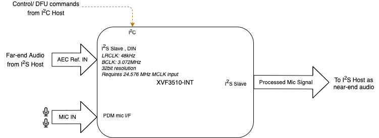
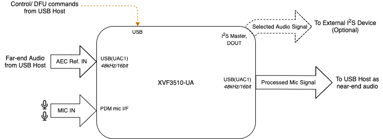
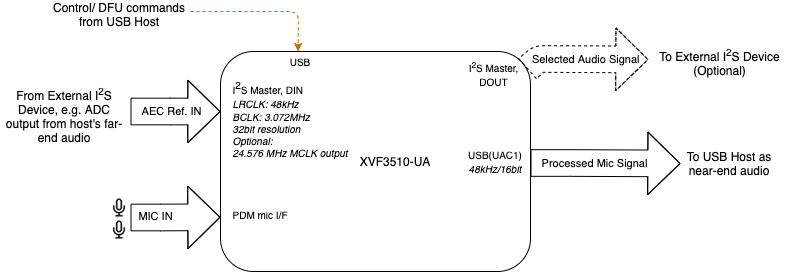

XVF3610 System Architecture
============================

System Block Diagrams
---------------------

XVF3610-INT Configuration
~~~~~~~~~~~~~~~~~~~~~~~~~

The XVF3610-INT device has been optimized for integration on a system
board. A standard I2C interface is provided to enable the main processor
on the system board to configure and monitor the XVF3610-INT. The
processed voice signal is output over an I2S bus to the host system and
the XVF3610 receives its I2S audio reference signal for the Acoustic
Echo Cancellation function.

  XVF3610-INT Integrated configuration

XVF3610-UA Configuration
~~~~~~~~~~~~~~~~~~~~~~~~

The XVF3610-UA device replaces the I2C interface of the XVF3610-INT with
a USB2.0 compliant PHY which supports a UAC1.0 audio device for both
reference signal input and processed audio output. In addition, the USB
device supports a standard USB Endpoint 0 for device control and a
standard USB HID for status events. An optional I2S master interface is
also available on the device to output an audio signal to an external
audio device.

The following block diagram illustrates the typical configuration.

  XVF3610-UA Configuration for USB-only use case

In addition to the standard USB configuration shown above, the
XVF3610-UA also supports an alternative configuration in which the AEC
reference signal is supplied over an I2S bus.

  XVF3610-UA Configuration using I2S audio reference

Device firmware and configuration
---------------------------------

The operation of the XVF3610 device is controlled through a firmware
image that is loaded onto the device when it is powered up. Two modes of
operation are supported:

#. The firmware image can either be stored in a QSPI Flash device which is read by the XFV3610 processor automatically,

or

#. The firmware image is downloaded to the XVF3610 processor over the SPI interface by the host processor on the system board.

Selection of the boot mode is made via setting the QSPI_D1/BOOTSEL pin
on the device as described in the datasheet.

The firmware image configures the XVF3610 into a standard, default
operational mode. This mode can be modified at startup via a set of
configuration parameters that are stored in the flash device along with
the firmware in the XVF3610 Data Partition. These commands can be used
to reconfigure the device during startup, and also initialise other
devices attached to it.

If the device firmware is downloaded from the host, then the data
partition is not required and the device is configured directly over the
control interface.
