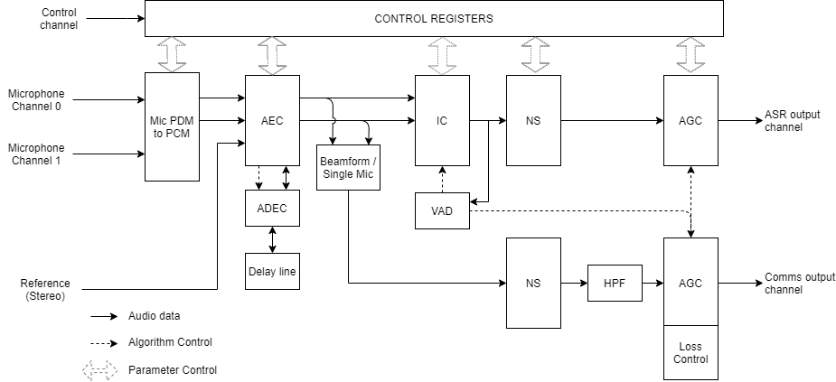
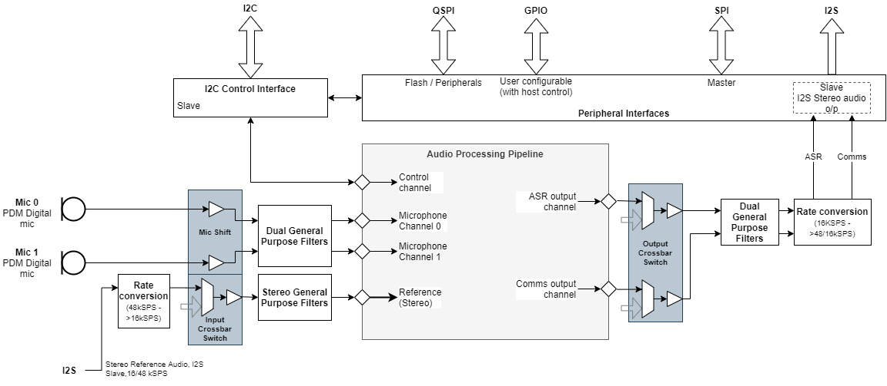
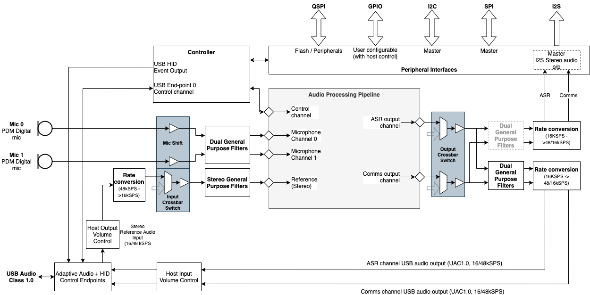

XVF3610 Voice Processing Pipeline
====================================

Overview
--------

The core of the XVF3610 voice processor is a high-performance audio
processing pipeline that takes its input from a pair of the microphone
and executes a series of signal processing algorithms to extract a voice
signal from a complex soundscape. The audio pipeline can accept a
reference signal from a host system which is used to perform Acoustic
Echo Cancellation (AEC) to remove audio being played by the host. The
audio pipeline provides two different output channels - one that is
optimized for Automatic Speech Recognition systems and the other for
voice communications.

Flexible audio signal routing infrastructure and a range of digital
inputs and outputs enable the XVF3610 to be integrated into a wide range
of system configurations, that can be configured at start up and during
operation through a set of control registers.

In addition, the XVF3610-UA variant supports a standard USB PHY
interface which supports a UAC audio device and device control over USB.
The following sections describe the voice pipeline and the surrounding
infrastructure in more detail.

Audio Processing Pipeline
-------------------------

The audio processing pipeline is common to both the XVF3610-UA and
XVF3610-INT firmware variants. The signal processing chain is described
below, with individual blocks and usage described in more detail in
subsequent sections.

The XVF3610 audio processing pipeline takes inputs from a pair of MEMS
Pulse Density Modulation (PDM) microphones and uses advanced signal
processing to create audio streams suitable for use in Automatic Speech
Recognition (ASR) and voice communication applications. The pipeline
enhances the captured audio stream using a set of complementary signal
enhancement and noise reduction processes.

  The XVF3610 audio pipeline

The pipeline takes its input from a pair of low-cost PDM microphones and
converts this signal to PCM for further processing:

-  **Acoustic Echo Cancellation (AEC):** Continuously modelling the room
   acoustics allows the AEC to remove audio being played into the
   room by the product which the XVF3610 is a component of. A
   reference copy of the audio is provided to the AEC in order for it
   to accurately estimate the echo.

-  **Automatic Delay Estimation & Control (ADEC):** Automatically
   monitors and automatically compensates for the delay between the
   reference audio and the echo received by the microphone.

Following echo cancellation, the ASR and communications paths diverge to
permit parameter tuning appropriate for the individual audio output use
cases.

-  **Interference Cancellation (IC):** Suppresses static noise from
   point sources such as cooker hoods, washing machines, or radios
   for which there is no reference audio signal available.

-  **Voice Activity Detection (VAD):** Controls adaption the IC and AGC
   to optimise output for near-end speech.

-  **Noise Suppression (NS):** Suppresses diffuse noise from sources
   whose frequency characteristics do not change rapidly over time
   (i.e., diffuse stationary noise).

-  **Automatic Gain Control (AGC):** Controls the audio output level via
   separate AGC channels for Automatic Speech Recognition (ASR) and
   communications output. The VAD is used to prevent gain changes
   during speech to improve speech recognition performance.

The pipeline has been designed to minimise the need to tune and modify
these functions. However, if required for specific use cases, these
later sections of this document provide details of the relevant
parameters and processes.

ASR and Communication Processing
--------------------------------

The audio pipeline discussed above produces two separate audio streams,
one specifically tuned for integration with keyword and ASR services and
the other designed for conferencing and communication applications. Both
processed audio streams are available simultaneously on the left and
right channels of the USB and I2S audio outputs. The default
configuration is as follows:

.. list-table:: Default channel mapping (both USB and I2S)
  :widths: auto
  :header-rows: 1

  * - Channel
    - Default
  * - [0] - Left
    - ASR
  * - [1] - Right
    - Communications

In situations where an ASR is used to invoke a call it may be necessary
to continually monitor the ASR channel for a ‘end call’ intent. The
parallel output of both ASR and Communications processed streams allow
the combination of high-quality calling audio with the tuned ASR
capability.

The IO_MAP configuration parameter (see *Signal flow and processing*
section) allows users to also configure both channels to be ASR or
Communications if required.

XVF3610-INT - For integrated voice interface applications
---------------------------------------------------------

The XVF3610-INT product embeds the core audio processing pipeline in an
audio infrastructure that supports rate conversion, filtering and signal
routing. This infrastructure is controllable by the host system via a
set of control registers. In addition, the XVF3610-INT provides a set of
peripheral interfaces to the host system to other devices, eg digital
inputs, LEDs, SPI peripherals etc.

The peripheral interfaces supported include an interface to an optional
QSPI Flash device containing the XVF3610 firmware and configuration
information that is loaded by the processor on startup.

The system architecture of the XVF3610-INT is shown below.

  XVF3610-INT System architecture

XVF3610-UA - For USB accessory voice interface applications
-----------------------------------------------------------

The XVF3610-UA variant includes the same audio infrastructure as the
XFV3610-INT, but it includes a USB interface that implements a UAC1.0
audio device to interface to the host system. The USB interface also
supports an Endpoint 0 control channel, and a USB HID to signal input
events to the host.

The system architecture of the XVF3610-UA is shown below.

  XVF3610-UA System architecture

NOTE: The XVF3610-UA product also supports a hybrid mode of operation
where the reference signal is delivered via I2S rather than USB. This
mode is selected via modification of the configuration data stored in
the flash device.
