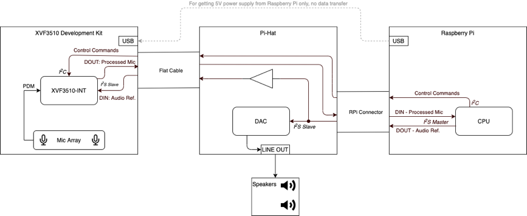
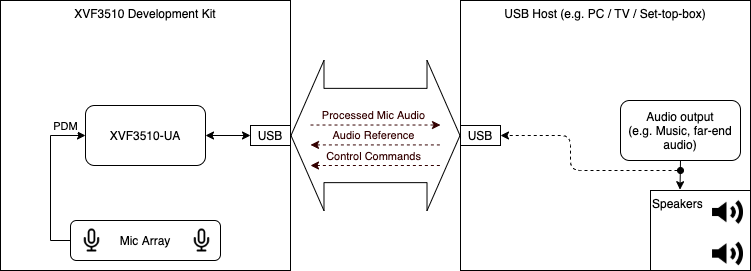
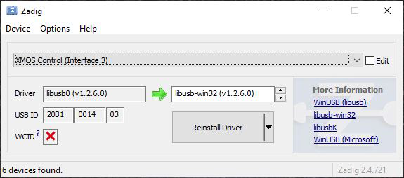

Development kits
=========================

The XVF3610 firmware can execute on the XMOS xcore.ai voice reverence platform.

.. todo::

  links to avona kit etc to be added

.. list-table:: Development kit variants and firmware pre-loaded
   :widths: 35 15 50
   :header-rows: 1

   * - Development kits
     - Firmware loaded
     - Notes
   * - Avona Ref design
     - ???
     - Link to kit

.. note::
  Users are recommended to check the website for the latest firmware update,
  and to follow the instructions to update the stored firmware before use.

The XMOS xcore.ai voice reference plaftorm and host code enable users to build
a complete Amazon Alexa endpoint with the addition of a Raspberry PI (not supplied).
The XVF3610-INT connects to the Raspberry PI using I2S for audio, and I2C
for control.

The signal flow through the development kit is shown below.

  Signal flow of the VocalFusion development kit for Amazon AVS (XVF3610-INT)

The  development kit provides a USB connection for audio and
control. This can be used for evaluation of other ASRs or simply
connected to a laptop or computer for audio analysis. In this
configuration only the XVF3610 processor board
board is required. The signal flow is shown below:

  Signal flow of the VocalFusion dev kit (XVF3610-UA)

Updating the firmware
---------------------

As described above the hardware used on both development kits are
identical allowing both firmware variants, -UA and -INT to operate
correctly on either kit. The following steps should be used to update
the firmware on the device.

#.  Download the XTC Tools tools from
    https://www.xmos.ai/software-tools and install onto the system that
    will be connected to the board to perform the update.

#. Download the latest version of the required XVF3610 Release Package from
    .. list-table:: Release packages
       :widths: 30 70
       :header-rows: 1

       * - Version
         - Location
       * - XVF3610-UA Release
         - https://www.xmos.ai/file/xvf3610-ua-release
       * - XVF3610-INT Release
         - https://www.xmos.ai/file/xvf3610-int-release

#.  Connect the XTAG Debugger to the system using the micro USB
    connection, plug the debugger into the XTAG connector, marked ‘DEBUG
    ONLY’, and power the board using micro USB connection marked USB on
    the XMOS processor board. (The power can be supplied via a USB
    connection from the system used to update, or a Raspberry Pi if
    used). The positions of these connectors are shown in the figure
    below:

    .. figure:: media/image9.png

    Location of Debug and power connectors on XVF3610 Development Kit Processor Board.

#.  Open up an ‘XTC Tools Command Prompt’, or configure a terminal
    window using the appropriate setEnv script defined for the platform. For
    further information please consult the XTC Tools User Guide (
    https://www.xmos.ai/file/tools-user-guide)

#.  From the ‘XTC Tools Command Prompt’ or configured terminal
    window, navigate to the location of the Release Pack root directory. If
    installing the XVF3610-INT use the following command to re-flash the
    board with the updated XVF3610-INT firmware (note multiple lines have
    been used for clarity in command examples, but should be executed on
    single line):

.. code-block:: bash

  xflash --boot-partition-size 1048576 --factory bin/app_xvf3610_int_vX_X_X.xe --data data-partition/images/data_partition_factory_int_vX_X_X.bin

If installing the XVF3610-UA use the following command to re-flash the
board with the latest XVF3610-UA firmware:

.. code-block:: bash

  xflash --boot-partition-size 1048576 --factory bin/app_xvf3610_ua_vX_X_X.xe --data data-partition/images/data_partition_factory_ua_vX_X_X.bin

Once the process has completed the following message indicates
successful completion:

.. code-block:: bash

  Site 0 has finished successfully

The board is now configured with the latest version of XVF3610-INT or
XVF3610-UA firmware.

Operation
---------

The basic operation of both development kit options is described in the
sections below.

XVF3610-INT Amazon AVS demonstration
~~~~~~~~~~~~~~~~~~~~~~~~~~~~~~~~~~~~

The VocalFusion dev kit for Amazon AVS uses the XVF3610-INT to provide
far-field voice to an AVS client running on a Raspberry Pi (not provided
in development kit). The VocalFusion Development Kit for Amazon AVS
Quick Start Guide and VocalFusion Development Kit for Amazon AVS User
Guide detail the setup and usage instructions.

These guides can be downloaded from
https://www.xmos.ai/file/xvf3610-dev-kit-setup-guides

The procedure for setting up the Amazon AVS SDK on the VocalFusion
Development Kit can be found at

https://github.com/xmos/vocalfusion-avs-setup

Now the system will operate as an AVS endpoint using the XVF3610-INT as
a Far-Field microphone, and Raspberry Pi to perform keyword detection
and run the client. If the option to start the client automatically has
been selected it will start on boot, otherwise, the following command
should be from a Raspberry Pi terminal.

avsrun

Control and configuration of the XVF3610-INT is achieved using the I2C
control interface. A VocalFusion Host Control application, (vfctrl_i2c),
is provided pre-compiled and as source code for this purpose.

The following steps explain how to use the host control application.

1. Copy the host directory of the Firmware Release Pack to the Raspberry Pi.

2. Navigate from a terminal window to the copied host directory and
execute the following command to list the supported commands and the
general form of the utility usage.

./pi/bin/vfctrl_i2c --help

To verify that the system is setup correctly use the following command
to list the I2C devices detected on the bus. The XVF3610-INT should
appear at bus address 0x2C.

i2cdetect -y 1

If the XVF3610-INT is detected on the bus, but vfctrl_i2c returns the
error:

rdwr ioctl error -1: No such device or address

check that the I2S clocks (MCLK, BCLK and LRCLK) are present and
operational. Control requests can only be serviced when the I2S clocks
are active.

XVF3610-UA USB connected demonstration
~~~~~~~~~~~~~~~~~~~~~~~~~~~~~~~~~~~~~~

The VocalFusion dev kit uses the XVF3610-UA to implement a USB Audio
Class 1.0 (UAC 1.0) Far-field microphone, which can be connected to any
USB host which can support UAC 1.0, such as laptop computers running
Windows, Linux or macOS or Single Board Computer (SBC) systems running
Linux or Android. The VocalFusion dev kit user guide and the VocalFusion
development kit quick start guide detail the setup and usage
instructions. These guides can be downloaded from
https://www.xmos.ai/file/xvf3610-dev-kit-setup-guides

For completeness, the set-up procedure is also summarised below.

- Connect the USB Host (eg. laptop or SBC) to the XVF3610-UA via a USB
  cable, and connect speakers to the host processor system. Once
  connected the XVF3610 will enumerate as “XVF3610 (UAC1.0)
  Adaptive”.

-  Next configure the output audio paths in the system such that both
   the speaker output and AEC reference paths (USB) are active.
   Details on how to enable this in Windows, MAC OS and Linux are
   provided in the User guide and quick start guides referenced
   above. Once configured, audio that is played out of the speakers
   will simultaneously be sent to the XVF3610 over USB providing a
   reference channel for the AEC.

-  Now the audio capabilities of the system can be explored using an
   audio analysis package such as Audacity to record and playback
   audio to evaluate the far-field performance, noise suppression,
   and echo cancellation.

Control and configuration of the XVF3610-UA are achieved using via the
control interface implemented over USB. A VocalFusion Host Control
application, vfctrl_usb, is provided pre-compiled and as source code for
this purpose.

For cross-platform support vfctrl_usb uses libusb. While this is
natively supported in macOS and most Linux distributions, it requires
the installation of a driver for use on a Windows host. Driver
installation should be done using a third-party installation tool like
Zadig (https://zadig.akeo.ie/). The following steps show how to install
the libusb driver using Zadig:

-  Connect the XVF3610 board to the host PC using a USB cable.

-  Open Zadig and select XMOS Control (Interface 3) from the list of
     devices. If the device is not present, ensure Options -> List All
     Devices is checked.

-  Select libusb-win32 from the list of drivers.

-  Click Reinstall Driver.

Once installed the vfctrl_usb utility is ready to use. The following
steps explain how to use the host control utility.

-  Copy the host directory of the Firmware Release Pack to the host
     platform.

2. Navigate, from a terminal window, to the copied host directory and
execute one of the following commands, depending on the specific
platform, to list the supported commands and the general form of the
utility usage.

For Linux hosts use:

./Linux/bin/vfctrl_usb --help

For macOS hosts:

./MAC/bin/vfctrl_usb --help

For Windows hosts:

.\\WIN32\\bin\\vfctrl_usb --help

Host Utilities
~~~~~~~~~~~~~~

There are seven host utilities provided in the VocalFusion XVF3610
Release Package as pre-compiled utilities and also as source code to
allow rebuilding other system architectures. The utilities are
summarised below:

data_partition_generator, vfctrl_json - Uses .json configuration
definition and generates binary Data Partitions for download to flash
memory. vfctrl_json is used internally by the data_partition_generator
but is referenced here for completeness.

dfu_suffix_generator - Adds DFU suffix to binary Boot Images and binary
Data Partitions to protect the device from accidental DFU of
incompatible image partition pair.

dfu_usb, dfu_i2c - DFU utilities for XVF3610-UA, XVF3610-INT
respectively

vfctrl_usb, vfctrl_i2c - Vocal Fusion Control Utilities for the
XVF3610-UA and XVF3610-INT respectively.

The pre-compiled versions are found in the following platform
sub-directories within the host directory:

host/Linux for Linux based systems

host/MAC for macOS

host/Pi for Raspbian based Raspberry Pi systems

host\\Win32 for Windows platforms.

Building the host utilities from source code
~~~~~~~~~~~~~~~~~~~~~~~~~~~~~~~~~~~~~~~~~~~~

The source code for these utilities is provided in the following
directory:

host\/src

The steps to build each utility are described in the Release Package
here:

host\/how_to_build_host_apps.rst

Default operation
~~~~~~~~~~~~~~~~~

The following table details the default configuration for the XVF3610-UA
and XVF3610-INT firmware v4.2 after update using the procedure described
above.

.. table:: Default configuration of xvf3610

    +--------------------+----------------+----------------+-------------+
    | Parameter          | Default - UA   | Default -INT   | Co          |
    |                    |                |                | nfigurable? |
    +====================+================+================+=============+
    | Version (x=patch   | v5.2.x         | v5.2.x         | N           |
    | version)           |                |                |             |
    +--------------------+----------------+----------------+-------------+
    | Reference input    | USB UAC 1.0    | I2S slave      | Y (prior to |
    | FROM host          |                |                | microphone  |
    |                    | 48k samples/s  | 48k samples/s  | and I2S     |
    |                    | PCM            | PCM            | start up    |
    |                    |                |                |             |
    |                    | 16-bit         | 32-bit         |             |
    |                    | resolution     | resolution     |             |
    +--------------------+----------------+----------------+-------------+
    | Reference format   | 1 or 2 channel | 1 or 2 channel | N           |
    |                    | (Mono /        | (Mono /        |             |
    |                    | Stereo)        | Stereo)        |             |
    +--------------------+----------------+----------------+-------------+
    | Processed audio    | USB UAC 1.0    | I2S bus        | Y (prior to |
    | output TO host     |                |                | microphone  |
    |                    | 48k samples/s  | 48k samples/s  | and I2S     |
    |                    | PCM            | PCM            | start up    |
    |                    |                |                |             |
    |                    | 16-bit         | 32-bit         |             |
    |                    | resolution     | resolution     |             |
    +--------------------+----------------+----------------+-------------+
    | Audio format to    | 2 channel -    | 2 channel -    | Y           |
    | host               | two different  | two different  |             |
    |                    | streams        | streams        |             |
    |                    |                |                |             |
    |                    | CH[0] - ASR    | CH[0] - ASR    |             |
    |                    |                |                |             |
    |                    | CH[1] - Comms  | CH[1] - Comms  |             |
    +--------------------+----------------+----------------+-------------+
    | USB Product String |  XVF3610       | -n/a-          | Y           |
    |                    | (UAC1.0)       |                |             |
    |                    | Adaptive       |                |             |
    +--------------------+----------------+----------------+-------------+
    | USB Vendor ID      | 0x20B1 (8369)  | -n/a-          | Y           |
    +--------------------+----------------+----------------+-------------+
    | USB Product ID     | 0x0016 (22)    | -n/a-          | Y           |
    +--------------------+----------------+----------------+-------------+
    | USB Vendor String  | XMOS           | -n/a-          | Y           |
    +--------------------+----------------+----------------+-------------+
    | USB Serial Number  | null           | -n/a-          | Y           |
    +--------------------+----------------+----------------+-------------+
    | I2C address        | N/A            | 0X2C           | N           |
    +--------------------+----------------+----------------+-------------+
    | MCLK               | 24.576MHz      | 24.576MHz      | Y           |
    |                    | OUTPUT         | INPUT          |             |
    +--------------------+----------------+----------------+-------------+
    | Acoustic Echo      | Enabled        | Enabled        | Y           |
    | Canceller          |                |                |             |
    +--------------------+----------------+----------------+-------------+
    | Automatic Delay    | Activated once | Activated once | Y           |
    | Estimator          | on startup     | on startup     |             |
    +--------------------+----------------+----------------+-------------+
    | Interference       | Enabled        | Enabled        | Y           |
    | Canceller          |                |                |             |
    +--------------------+----------------+----------------+-------------+
    | Noise suppressor   | Enabled        | Enabled        | Y           |
    +--------------------+----------------+----------------+-------------+
