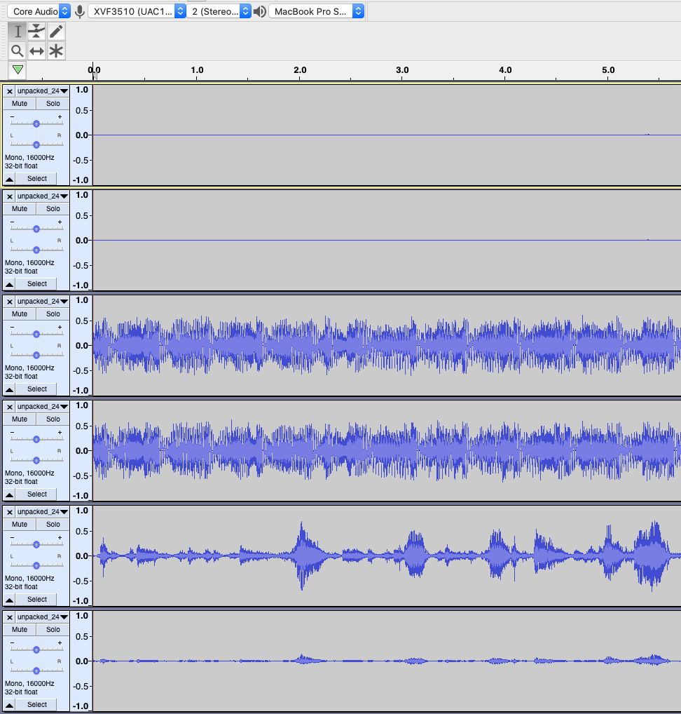

Capturing packed samples for system integration
===========================================================

To assist with system integration, the XVF3610 provides the ability to
pack multiple 16kHz channels into a 48kHz output. The following section
describes the usage of packed signals.

.. note::

	All packed functions provide a **snapshot of a 16kHz signals over a 48kHz output**. If the output stream is not 48kHz, it will not work because the 3x bandwidth is needed for packing the 16kHz signals. They all also require that **no volume scaling be applied on the host** otherwise it will break the marker sequence resulting in the captured audio being unable to be unpacked.

There are two packing mechanisms however for typical usage where a full capture of the pipeline is needed, PACKED_ALL is recommended.

Capturing PACKED_ALL signals
-----------------------------------------

PACKED_ALL packs 3 channels into a single channel (mic, ref, pipeline
out) so requires two output channels to capture all 6 signals of
interest. When using -UA it uses the bit resolution of the USB output
interface (even if you output to I2S on the -UA device) or assumes 32b
it you are using -INT where the output interface is always I2S. The
sequence is as follows:

*  top bitres-1 bits of mic sample with LSbit marker ‘0’

*  top bitres-1 bits of ref sample with LSbit marker ‘1’

*  top bitres-1 bits of pipeline oit sample with LSbit marker ‘1’

The unpacker_packed_all.pyscript looks for 0, 0, 1 for the LS bit to
check for a packed_all sequence, else it will report an error. This
packing will work with 16b, 24b and 32b USB bit width. It is not
bit-perfect (it loses 1b for the marker). It can work on a Mac if you
use a 16b or 24b output resolution on -UA device. Since microphones
signal levels are quite low from the output of the decimators, it is
recommended to use at least 24b resolution to keep the quantisation
noise floor down with respect to signal.

Capturing all pipeline input and output signals over a 48kHz USB interface
-----------------------------------------------------------------------------

The goal here is to capture the pipeline input and output to provide
visibility on what signals are actually entering the pipeline and what
processed output was generated. This can be useful when checking the
microphone and reference signals are correctly routed, as well as
checking signal delay issues causing poor AEC performance.

First, set the USB output interface resolution to 24b. This is important
because mic signals in a quiet room (35dBA) may be quantised away in a
16b audio capture. Also, 24b audio has been found to work on most hosts.

Second, configure the audio crossbar to output PACKED_ALL on USB output
channels 0 and 1.

This can be done by setting the parameters in the data partition. To do
this, navigate to the data-partition directory of the Release package.
Note, it recommended to make a copy of the default .json config file for
future reference.

To create the “packed output to USB” commands in file
input/set_packed_all_on_usb_out.txt Add the following contents to this
file.

.. code-block:: bash

  SET_IO_MAP 0 16
  SET_IO_MAP 1 16

Note that the IO map source 16 is set for both USB output channels.
Source 16 automatically resolves the channel indices so this will result
in a stereo output containing a packed capture of all six discrete
channels of interest.

Next, add the following sections to a ua_24b_packed.json file item
section and save it:

.. code-block:: json

  {
  "path": "input/set_packed_all_on_usb_out.txt",
  "comment": ""
  },

  {
  "path": "input/device_to_usb_bit_res_24.txt",
  "comment": ""
  },

Now we generate the data partition from our updated json file:

.. code-block:: bash

  python3 xvf3610_data_partition_generator.py ua_24b_packed.json

This will generate the new data partition file as
follows: ``output/data_partition_factory_ua_24b_packed_v4_0_0.bin``

Finally ``cd ..`` to go up one level to root of the release package and flash the
firmware along with the newly created data partition configuration file:

.. code-block:: bash

  `xflash --no-compression --boot-partition-size 1048576 bin/app_xvf3610_ua_v4_0_0.xe --data data-partition/output/data_partition_factory_ua_24b_packed_v4_0_0.bin`

Once the firmware has booted following the flashing operation it can be
verified in the sound control panel that the USB input stream from the
XVF3610-UA to the host is now set to 24b.

Next the audio of interest is captured. Do this with a wav capture
utility to capture the stereo output from the USB input from the XVF3610
device at 48kHz. Ensure the file is saved as 32b Signed Integer which is
needed for the next step. Note that viewing/listening to the packed wav
is non-sensical because it contains packed/multiplexed signals and will
sound noisy.

Finally convert these packed files into unpacked, 16kHz, 6-Channel audio
files.

.. code-block:: bash

  python host/unpacker_packed_all.py packed_capture.wav unpacked_6ch_16kHz.wav 24

The output file unpacked_6ch_16kHz.wav may now be inspected. Note that
the channel assignment is as follows:

#.  Microphone Ch 0
#.  Microphone Ch 1
#.  Reference input Left
#.  Reference input Right
#.  Pipeline Output Ch 0 (nominally ASR)
#.  Pipeline Output Ch 1 (nominally Comms)

Below is a visualisation of a six-channel audio capture. Note the
relatively quiet mic signals compared with the reference. This is
typical and allows for loud near-end signals without distortion.

Packing specific signals
-------------------------

PACKED_PIPELINE_OUTPUT, PACKED_MIC, PACKED_REF all use the same
underlying packing function. They pack 2 channels (mic0/1 or ref/refr
or pipe0/pipe1) into a single audio channel. **It requires that the
output interface, including host processing, be capable of bit-perfect
32b audio**. It packs the two 16kHz samples into three 48kHz samples as
follows: 

*  top 24b of sample[0] with 8b LSB marker ‘0x00’

*  top 24b of sample[1] with 8b LSB marker ’0x01’

*  the bottom 8b of sample[0], the bottom 8b of sample[1], 0x00, 8b LSB marker ’0x02’ 

The ``unpacker.py`` script then looks for 0x00, 0x01, 0x02 in the LSByte to
check for a packed sequence. So inspecting the wav in a hex editor
should make it clear when it is captured properly. 

It will capture bit-perfect data.

.. warning::

  Packing specific signals will not work on a Mac because it only supports
  24b audio due to core audio representing audio using single-precision
  floating-point. It has been tested and works well on Linux (x86/RPI)
  which supports bit-perfect 32b audio.
